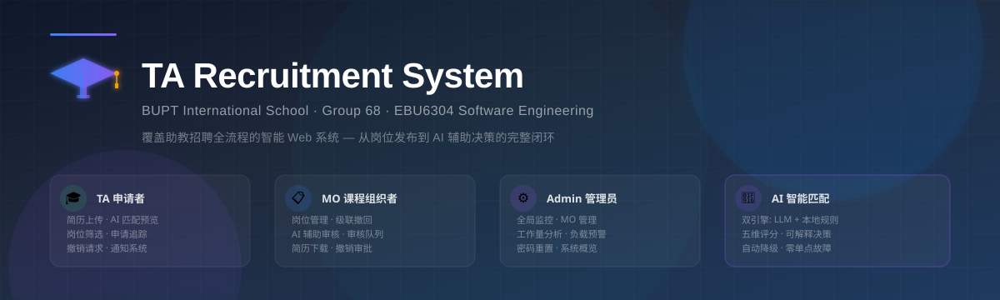
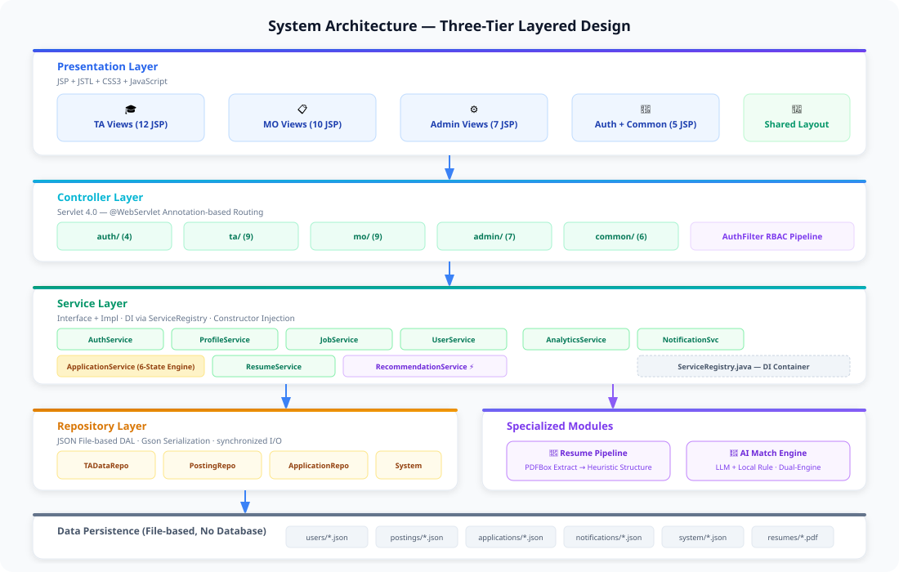
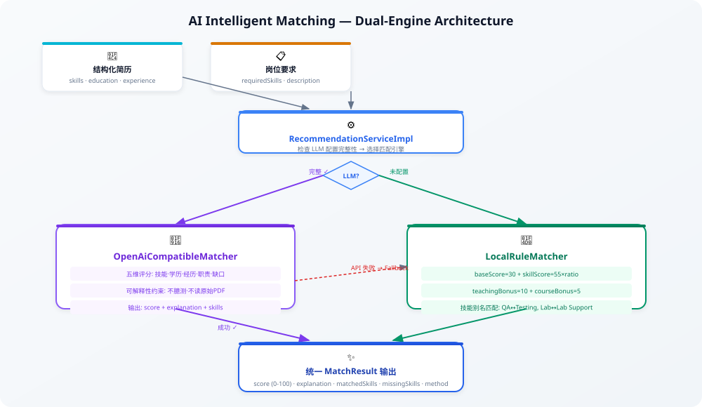

<p align="center">
  <a href="README.md">中文</a> · <a href="README_EN.md">English</a>
</p>

<p align="center">
  
</p>

<p align="center">
  
  
  
  
  
  
  
  
</p>

<h2 align="center">
  覆盖助教招聘全流程的智能 Web 系统
</h2>

<p align="center">
  连接 <code>TA 申请者</code> · <code>课程组织者 (MO)</code> · <code>系统管理员 (Admin)</code> 三大角色<br>
  从 <b>岗位发布</b> → <b>简历投递</b> → <b>AI 智能匹配</b> → <b>人工审核</b> → <b>工作量分析</b> 的完整闭环
</p>

<p align="center">
  <a href="#-team-members">👥 Team</a> ·
  <a href="#-quick-start">🚀 Quick Start</a> ·
  <a href="#-system-architecture">🏗 Architecture</a> ·
  <a href="#-core-features">🎯 Features</a> ·
  <a href="#-ai-intelligent-matching">🤖 AI Matching</a> ·
  <a href="#-innovations--highlights">💡 Innovations</a> ·
  <a href="#-data-model">📊 Data Model</a> ·
  <a href="#-application-lifecycle">🔄 Lifecycle</a> ·
  <a href="#-project-structure">📂 Structure</a> ·
  <a href="#-tech-stack">🛠 Tech Stack</a> ·
  <a href="#-development-workflow">⚡ Dev Workflow</a> ·
  <a href="#-testing-strategy">🧪 Testing</a> ·
  <a href="#-demo-accounts">🎮 Demo</a> ·
  <a href="#-security--privacy">🔐 Security</a> ·
  <a href="#-documentation">📚 Docs</a>
</p>

---

## 👥 Team Members

| GitHub Username | QMID |
| :--- | :--- |
| [`Liu-2806`](https://github.com/Liu-2806) | `231226532` |
| [`ffelaine`](https://github.com/ffelaine) | `231226347` |
| [`deer-ice`](https://github.com/deer-ice) | `231226406` |
| [`ShaoyangZhu`](https://github.com/ShaoyangZhu) | `231226370` |
| [`skywalker11111`](https://github.com/skywalker11111) | `231226439` |
| [`NoveAmberic`](https://github.com/NoveAmberic) | `231226495` |

---

## 🚀 Quick Start

### 环境要求

| 项目 | 要求 |
| :--- | :--- |
| 操作系统 | Windows 10 / 11 |
| JDK | 21 ([Adoptium](https://adoptium.net/temurin/releases/?version=21)) |
| Servlet 容器 | Apache Tomcat 9.x ([下载](https://tomcat.apache.org/download-90.cgi)) |
| Shell | PowerShell 5.x+ |
| 编码 | UTF-8 |

### 一键启动

```powershell
# 1. 克隆项目
git clone https://github.com/Liu-2806/TA-Recruitment-System-Group68.git
cd TA-Recruitment-System-Group68

# 2. 确认 JDK 21
java -version   # 应输出 21.x

# 3. 一键启动（Tomcat 需在父目录，或通过 -TomcatPath 指定）
powershell -ExecutionPolicy Bypass -File .\scripts\run-web-app.ps1

# 4. 浏览器访问
# http://localhost:8080/TA-Recruitment-System-Group68/
```

> **Tomcat 默认查找路径：** 仓库父目录下的 `apache-tomcat-9.0.116/`。若安装位置不同，使用 `-TomcatPath "C:\path\to\tomcat"` 参数指定。

---

## 🏗 System Architecture

<p align="center">
  
</p>

系统采用经典 **三层分层架构 (Three-Tier Layered Architecture)**，将表示层、业务逻辑层和数据持久层严格分离：

### 核心实体 (5 Core Entities)

| 实体 | 说明 | 持久化位置 |
| :--- | :--- | :--- |
| **User** | 认证 + 角色 (TA/MO/ADMIN) | `data/users/*.json` |
| **TAProfile** | 候选人信息 + 简历 + 课表 | `data/users/ta.json` |
| **JobPosting** | 岗位 + 技能要求 + 排班 | `data/postings/postings.json` |
| **Application** | TA 到岗位的关联 + 状态 + AI 匹配分 | `data/applications/applications.json` |
| **Notification** | 事件驱动的消息通知 | `data/notifications/notifications.json` |

### 核心组件详解

<details>
<summary><b>ServiceRegistry — DI 容器</b></summary>

`ServiceRegistry.java` 是系统的中央依赖注入容器。在类加载时按依赖顺序实例化：
1. 先创建 **7 个 Repository** 单例（TADataRepository, PostingDataRepository, ApplicationDataRepository, SystemDataRepository, TATimetableDataRepository 等）
2. 再通过**构造器注入**创建 **7 个 Service** 单例（AuthService, ProfileService, JobService, ApplicationService, ResumeService, RecommendationService, AnalyticsService）

Controller 从不自己 `new` 服务，而是通过 `ServiceRegistry` 的静态方法获取，确保每个服务只有一个共享实例，依赖关系集中可见，防止循环依赖。
</details>

<details>
<summary><b>AuthFilter — RBAC 三阶段管道</b></summary>

`@WebFilter("/*")` 拦截所有请求，三阶段处理：
1. **白名单放行：** `/auth/login`, `/auth/register`, `/assets/*`, `/dev/login-as` 等公开路径
2. **认证检查：** 未登录的请求重定向到 `/auth/login`
3. **角色权限检查：** `/ta/*` 需要 `Role.TA`，`/mo/*` 需要 `Role.MO`，`/admin/*` 需要 `Role.ADMIN`。越权访问转发到 `403.jsp`

`Role` 枚举提供编译期类型安全，无需字符串比较。
</details>

<details>
<summary><b>Application Lifecycle Engine — 六状态引擎</b></summary>

`ApplicationServiceImpl.java` (~760 行) 实现了完整的申请生命周期：

**六条件门控 (6-Condition Eligibility Gate)：**
| # | 条件 | 检查内容 |
| :--- | :--- | :--- |
| 1 | 资料完整 | studentId, majorProgram, academicYear 已填写 |
| 2 | 简历已上传 | resumeFileName 非空 |
| 3 | 非重复申请 | 同一 TA + 同一岗位无已有申请 |
| 4 | 截止日期 | 当前日期 ≤ posting.deadline |
| 5 | 岗位开放 | posting.status == OPEN |
| 6 | 时间无冲突 | 基于分钟级区间重叠比较 (lines 485-510) |

全部通过后才创建申请记录，同时执行 AI 匹配评分并向 MO 发送通知。
</details>

<details>
<summary><b>Notification System — 7 种事件通知</b></summary>

| 事件类型 | 接收者 | 触发时机 | 需操作 |
| :--- | :--- | :--- | :---: |
| `NEW_APPLICATION` | MO | TA 提交新申请 | ❌ |
| `APPLICATION_ACCEPTED` | TA | MO 接受申请 | ❌ |
| `APPLICATION_REJECTED` | TA | MO 拒绝申请 | ❌ |
| `APPLICATION_AUTO_WITHDRAWN` | TA | MO 编辑岗位导致级联撤回 | ❌ |
| `REVOCATION_REQUEST` | MO | TA 请求撤销已接受岗位 | ✅ |
| `REVOCATION_APPROVED` | TA | MO 批准撤销 | ❌ |
| `REVOCATION_REJECTED` | TA | MO 拒绝撤销 | ❌ |

每条通知携带 recipientId, entityId, timestamp, resolved flag。撤销请求通知保持 **unresolved** 状态直到 MO 响应。
</details>

<details>
<summary><b>View Layer — 共享布局模板系统</b></summary>

所有页面使用 `layout.jsp` 共享模板。Controller 设置 `bodyPage` 和 `pageTitle`，layout 自动嵌入 header、角色侧边栏、footer。

- **CSS 模块化：** base.css + components.css + layout.css + **19 个**页面专用 CSS
- **JS 模块化：** common.js + toast.js + **9 个**页面专用脚本
- **JSTL 渲染：** 所有视图使用 JSTL 条件渲染和迭代，零 scriptlet 代码
- **错误页面共享：** 403.jsp, error.jsp 跨模块复用

这种模板架构让 **6 人并行开发** 各自模块的同时保持全站视觉一致。
</details>

---

## 🎯 Core Features

### 三大角色功能矩阵

| 功能 | TA 申请者 | MO 课程组织者 | Admin 管理员 |
| :--- | :---: | :---: | :---: |
| 注册 / 登录 | ✅ | ✅ (Admin 创建) | ✅ |
| 个人资料管理 | ✅ | ✅ | — |
| PDF 简历上传与智能提取 | ✅ | — | — |
| 岗位浏览与多维筛选 | ✅ | — | 全局监控 |
| **AI 智能匹配分析** | ✅ | ✅ | — |
| 在线申请与 6 条件门控 | ✅ | — | — |
| 申请状态追踪 (6 种状态) | ✅ | — | — |
| 撤回 (Withdraw) | ✅ | — | — |
| 撤销请求 (Revocation Request) | ✅ | — | — |
| 岗位 CRUD + 级联撤回 | — | ✅ | — |
| Activity 活动岗位创建 | — | ✅ | — |
| 申请人审核 (Accept/Reject) | — | ✅ | — |
| 审核队列与优先级排序 | — | ✅ | — |
| 行内决策 + 审核备注 | — | ✅ | — |
| 撤销请求审批 | — | ✅ | — |
| 实时通知系统 (7 种) | ✅ | ✅ | — |
| MO 账号管理 (创建/重置) | — | — | ✅ |
| 全局岗位监控 | — | — | ✅ |
| TA 工作量分析与预警 | — | — | ✅ |
| 工作量分布图表 | — | — | ✅ |
| 智能管理建议 | — | — | ✅ |

---

### 🎓 TA — 助教申请者

```
注册 → 完善资料 → 上传 PDF 简历 → 浏览岗位 → 查看匹配分析 → 提交申请 → 追踪状态
```

| 功能 | 详情 |
| :--- | :--- |
| **简历智能提取** | PDFBox 提取文本 → 启发式结构化 → 7 字段 (name, email, phone, education, skills, experienceHighlights, rawText) → JSON 持久化 |
| **多维岗位筛选** | 关键词搜索 + 专业/部门/模块类型筛选 + 4 种排序 (最新/截止日期/匹配度/名称 A-Z) |
| **匹配度预览** | 每个岗位卡片直接展示匹配等级标签 (Strong ≥ 80 / Moderate 60-79 / Weak < 60) |
| **6 条件申请门控** | 资料完整度 + 简历上传 + 重复申请 + 截止日期 + 岗位状态 + **时间冲突检测** (分钟级区间重叠) |
| **申请前确认页** | 展示岗位信息、匹配分数、检查清单、个人陈述输入框 |
| **申请状态追踪** | 6 种状态实时流转 + 状态标签颜色 + 匹配说明 |
| **撤回 (Withdraw)** | 对 SUBMITTED 状态申请一键撤回，不可逆 |
| **撤销请求 (Revocation)** | 对 ACCEPTED 状态岗位提交撤销请求 + 填写原因，需 MO 审批 |

---

### 📋 MO — 课程组织者

```
创建岗位 → 查看申请人 → AI 辅助审核 → Accept/Reject → 处理撤销请求
```

| 功能 | 详情 |
| :--- | :--- |
| **岗位全生命周期** | 创建 → 编辑 → 关闭 → 重新开放；支持 TA 课程助教和 Activity 一次性活动岗位 |
| **Activity 活动岗位** | 项目评审 / 监考 / 实验支持，含日期、时间、地点字段 |
| **级联撤回 (Cascade)** | 编辑岗位描述或技能时，自动撤回所有 SUBMITTED 申请，通知受影响 TA |
| **AI 辅助审核** | 申请人列表按匹配分数降序排列，行内 Accept/Reject 即时生效 |
| **审核队列** | 汇总所有待审核申请，优先级标注 (High ≥ 80 / Medium 60-79 / Low < 60) |
| **简历下载** | 直接下载申请人原始 PDF 简历，结合 AI 分析综合判断 |
| **撤销请求处理** | 在通知中直接 Approve/Reject，批准后释放 TA 课表时段 |
| **MO 仪表盘** | 待审核数 + 活跃岗位数 + 截止提醒 + 活跃岗位列表 + 最近活动 |

---

### ⚙️ Admin — 系统管理员

```
系统概览 → MO 管理 → 全局岗位监控 → TA 工作量分析
```

| 功能 | 详情 |
| :--- | :--- |
| **全局仪表盘** | TA 总数、MO 总数、岗位总数、开放岗位数、待审核申请数、活跃招聘数 + 最近 8 条系统活动 |
| **MO 账号管理** | 创建 MO 账号 (用户名/姓名/工号/邮箱/部门/密码) + 查看详情 + 密码重置 |
| **全局岗位监控** | 查看所有 MO 的岗位，按 MO/状态/关键词筛选，按发布时间/截止日期/申请数排序 |
| **TA 工作量分析** | 工时统计 + 活跃岗位数 + 负载分级 (NORMAL < 12h / HIGH_ALERT ≥ 12h) |
| **工作量分布图** | 工时分布桶 (0-4h / 4-8h / 8-12h / 12h+) + 高工时预警人数 + 最高工作量专业组 |
| **风险等级评估** | LOW (< 4h) / MEDIUM (4-8h) / HIGH (≥ 12h)，每级自动生成管理建议 |
| **智能管理建议** | HIGH: 避免额外任务，协调重新分配；MEDIUM: 优先短时任务；LOW: 可承担短时任务 |

---

## 🤖 AI Intelligent Matching

<p align="center">
  
</p>

### 双引擎架构 (Dual-Engine)

系统采用 **Strategy 设计模式**，动态选择匹配引擎：

```
RecommendationServiceImpl 检查 LLM 配置
    │
    ├── 配置完整 → OpenAiCompatibleMatcher (LLM 路径)
    │                │
    │                ├── 成功 → 返回 MatchResult (method = "api-llm")
    │                │
    │                └── 失败 → 自动 Fallback 到 LocalRuleMatcher
    │                           (method = "local-rule-fallback")
    │
    └── 未配置 → LocalRuleMatcher (本地规则)
                 (method = "local-rule")
```

**关键设计：无论外部 AI 服务是否可用，系统始终产出匹配结果，零单点故障。**

### LLM 五维评分

当 LLM API 配置完整时，系统向 AI 端点发送结构化简历和岗位信息，Prompt 包含严格的五维评分框架：

| 维度 | 说明 |
| :--- | :--- |
| 🧠 **技能重合度** | 简历提取技能 vs 岗位 requiredSkills 的匹配程度 |
| 🎓 **教育背景相关性** | 学历 (education) 和专业与岗位的相关性 |
| 👨‍🏫 **教学/学术支持经历** | experienceHighlights 中是否含助教、辅导、教学相关经验 |
| 📋 **岗位职责适配性** | 经历亮点与岗位描述 (description) 中职责的匹配度 |
| ⚠️ **关键缺口** | 简历中未体现的岗位关键技能或经验 |

#### 可解释性约束 (Explainability Constraints)

- AI **不**读取原始 PDF，**不**引入外部知识
- 只分析系统传入的结构化字段 (skills, education, experienceHighlights)
- 若输入中不存在某项证据，必须标注 **"缺少证据"** 而非臆测
- `explanation` 必须同时覆盖：匹配证据 + 关键缺口 + 适配性判断
- 必须明确标注 **"仅供人工决策参考，不是自动录用依据"**

### 本地规则算法 (LocalRuleMatcher)

当 LLM 不可用时，本地规则提供确定性评分：

```
baseScore     = 30                              (基础分)
skillScore    = 55 × (matched / required)       (技能匹配分)
teachingBonus = 10  (含 "assistant"/"teaching"/"tutor" 关键词)
courseBonus   = 5   (含课程编号或课程名称)

finalScore    = min(100, max(0, Σ))
```

#### 技能匹配策略

| 策略 | 说明 |
| :--- | :--- |
| **精确匹配** | 技能名称规范化 (统一小写、去空格/特殊字符) 后比较 |
| **别名匹配** | QA ↔ Testing ↔ QualityAssurance · Lab Support ↔ Lab · Tutoring ↔ Tutor · Marking ↔ Grading |
| **包含匹配** | 一个技能名称包含另一个时视为匹配 |

### 统一输出格式

无论哪种引擎，输出格式严格一致：

| 字段 | 类型 | 说明 |
| :--- | :--- | :--- |
| `score` | int (0-100) | 匹配分数 |
| `explanation` | string | 匹配解释 (完整分析文本) |
| `method` | string | 匹配方法: `api-llm` / `local-rule` / `local-rule-fallback` |
| `matchedSkills` | string[] | 已匹配的技能列表 |
| `missingSkills` | string[] | 缺失的技能列表 |

#### 运行时派生字段 (仅用于 UI 渲染，不持久化)

| 字段 | 说明 |
| :--- | :--- |
| `scoreBand` | Strong Match (≥80) / Moderate Match (60-79) / Weak Match (<60) |
| `strengthSummary` | 优势摘要文本 |
| `riskSummary` | 风险提示文本 |
| `nextStepSuggestion` | 下一步操作建议 |
| `confidenceHint` | 结果置信度说明 |
| `methodLabel` | 匹配方法的用户友好标签 |
| `methodHint` | 匹配方法的说明文本 |

### LLM 配置指南 (Optional)

```bash
# 1. 复制配置模板
cp .env.example .env.local

# 2. 编辑 .env.local
LLM_API_URL=https://api.deepseek.com/v1
LLM_API_KEY=your_api_key_here
LLM_MODEL=deepseek-chat

# 3. .env.local 已在 .gitignore 中，不会被提交
# 4. 不配置则自动使用本地规则匹配，功能完全可用
```

> **DeepSeek 兼容性：** 支持 `https://api.deepseek.com` 和 `https://api.deepseek.com/v1` 两种格式，代码自动补全 `/v1` 后缀。

---

## 💡 Innovations & Highlights

### 🌟 十大核心创新

| # | 创新点 | 说明 |
| :--- | :--- | :--- |
| 1 | **双引擎 AI 匹配** | LLM + 本地规则双路架构，Strategy 模式动态选择，API 不可用时自动降级，**零单点故障** |
| 2 | **可解释 AI 决策** | 五维评分框架 + 证据/缺口/置信度说明，严格遵守 handout 可解释性要求，AI 结果**不作为自动录用依据** |
| 3 | **6 条件申请门控** | 资料完整性 + 简历 + 去重 + 截止日期 + 岗位状态 + **分钟级时间冲突检测** (interval overlap, lines 485-510) |
| 4 | **级联撤回机制** | MO 编辑关键信息 (描述/技能) 自动撤回所有已提交申请，`applicationCount` 归零，通知受影响 TA 重新申请 |
| 5 | **撤销请求工作流** | TA 对已接受岗位可提交撤销请求 (含原因)，MO 审批后释放课表时段，双向通知，**多角色协同** |
| 6 | **简历智能提取管线** | PDFBox 3.0.2 提取 → 启发式规则结构化 → 7 字段输出 → JSON 持久化，**全自动处理** |
| 7 | **实时通知系统** | 7 种事件类型，含 **需操作通知** (Revocation Request)，MO 在通知内直接 Approve/Reject 决策 |
| 8 | **TA 工作量预警** | 工时统计 + 负载分级 (NORMAL/HIGH_ALERT) + 风险等级 (LOW/MEDIUM/HIGH) + **智能管理建议** |
| 9 | **多角色 RBAC** | AuthFilter 三阶段管道：白名单 → 认证 → 角色权限，`Role` 枚举**编译期类型安全** |
| 10 | **共享布局模板** | layout.jsp 模板 + 19 页面 CSS + 9 页面 JS，**6 人并行开发**保持全站视觉一致 |

### 🏗 工程亮点

| 亮点 | 说明 |
| :--- | :--- |
| **无数据库设计** | 全部 JSON 文件存储，Gson 序列化，`synchronized` 方法保证并发安全 |
| **ServiceRegistry DI** | 手工依赖注入容器，构造器注入 7 Repo + 7 Service，依赖图清晰可见 |
| **Annotation 路由** | `@WebServlet` 注解替代 XML，路由变更零配置维护 |
| **零构建框架** | 纯 `javac` + PowerShell 脚本，提交 JAR 保证 6 人环境一致 |
| **风险缓解** | Phase 1 Console 原型验证数据模型 → Phase 2 静态 JSP → Phase 3 Servlet 集成 → Phase 4 AI + 通知 |
| **文档先行** | 694 行 `interface-design.md` 定义所有 API 契约，6 人协作统一接口 |

---

## 📊 Data Model

系统建模 **5 个核心实体**，以 JSON 数组持久化在 `data/` 目录下的独立文件中。实体间通过 ID 字段交叉引用：

```
User (userId)
  │
  ├── TAProfile (taId → User.userId)
  │     └── extractedResume (结构化简历, 7 字段)
  │     └── timetable (周排班数据)
  │
  ├── MOProfile (moId → User.userId)
  │     └── JobPosting[] (postingId, moId)
  │           └── schedule[] ({dayOfWeek, startTime, endTime})
  │
  └── Application (applicationId)
        ├── taId → User.userId
        ├── postingId → JobPosting.postingId
        ├── status → ApplicationStatus enum (6 种)
        ├── skillMatchScore (0-100)
        └── matchedSkills[] / missingSkills[]
```

### 数据文件清单

| 文件路径 | 格式 | 说明 |
| :--- | :--- | :--- |
| `data/users/ta.json` | JSON 数组 | TA 用户数据 (含简历提取结果 + 技能标签) |
| `data/users/mo.json` | JSON 数组 | MO 用户数据 (含部门、工号) |
| `data/users/admin.json` | JSON 数组 | Admin 用户数据 |
| `data/postings/postings.json` | JSON 数组 | 所有岗位数据 (含排班 schedule[]) |
| `data/applications/applications.json` | JSON 数组 | 所有申请记录 (含 AI 匹配结果) |
| `data/notifications/notifications.json` | JSON 数组 | 所有通知记录 (含 resolved flag) |
| `data/system/skill-tags.json` | JSON 数组 | 预置技能标签 (Java, Python, Git 等) |
| `data/system/ta-timetable.json` | JSON 对象 | TA 课表数据 (周排班 + 岗位时段) |
| `data/resumes/` | PDF 文件 | 上传的简历原始文件 |

---

## 🔄 Application Lifecycle

```
                          ┌─────────────┐
                          │  SUBMITTED   │
                          │  (已提交)     │
                          └──┬─────┬─────┘
                             │     │
               MO Accept     │     │    MO Reject
                             │     │
                      ┌──────▼─┐ ┌─▼────────┐
                      │ACCEPTED │ │ REJECTED  │
                      │ (已接受) │ │ (已拒绝)   │
                      └──┬─────┘ └───────────┘
                         │
           TA 撤销请求    │
                         │
                  ┌──────▼───────────┐
                  │REVOCATION_REQUESTED│
                  │  (请求撤销)         │
                  └──┬───────────┬────┘
                     │           │
      MO Approve     │           │   MO Reject
                     │           │
              ┌──────▼──┐   ┌────▼─────┐
              │WITHDRAWN │   │ ACCEPTED │
              │ (已撤回)  │   │ (恢复接受)│
              └──────────┘   └──────────┘

  TA 主动撤回:  SUBMITTED ──Withdraw──→ WITHDRAWN
  MO 级联撤回:  SUBMITTED ──Edit 关键信息──→ WITHDRAWN + 通知 TA
```

| 状态 | 含义 | TA 可操作 | MO 可操作 |
| :--- | :--- | :---: | :---: |
| `SUBMITTED` | 已提交，待审核 | Withdraw (撤回) | Accept / Reject |
| `UNDER_REVIEW` | MO 正在查看 | — | Accept / Reject |
| `ACCEPTED` | MO 已接受 | Revocation Request | — |
| `REJECTED` | MO 已拒绝 | — | — |
| `WITHDRAWN` | 已撤回/撤销 | — | — |
| `REVOCATION_REQUESTED` | TA 请求撤销 | — | Approve / Reject |

---

## 📂 Project Structure

```
TA-Recruitment-System-Group68/
│
├── src/com/bupt/ta/              ← Java 源码主框架
│   ├── config/                   │  ServiceRegistry (DI 容器)
│   ├── controller/               │  Servlet 控制器 (30+)
│   │   ├── auth/                 │  │  LoginServlet · Register · Logout · RoleSelect
│   │   ├── ta/                   │  │  Dashboard · Profile · Jobs · Apply · MyApplications
│   │   ├── mo/                   │  │  Dashboard · Jobs CRUD · Applicants · ReviewQueue
│   │   ├── admin/                │  │  Dashboard · MO Mgmt · Job Monitor · Workload
│   │   └── common/               │  │  DevLogin · Error · Legal · AccessDenied
│   ├── service/                  │  业务接口 (7 个)
│   │   └── impl/                 │  业务实现 (7 个)
│   ├── repository/file/          │  JSON 文件数据访问层 (7 个 Repo)
│   ├── resume/                   │  PDF 简历提取管线
│   │   ├── PdfResumeExtractor    │  │  PDFBox 3.0.2 文本提取
│   │   └── ResumeStructurer      │  │  启发式规则结构化 (7 字段)
│   ├── match/                    │  AI 双引擎匹配
│   │   ├── RecommendationServiceImpl  │  引擎调度器
│   │   ├── OpenAiCompatibleMatcher    │  LLM 匹配 (五维评分)
│   │   ├── LocalRuleMatcher           │  本地规则匹配
│   │   ├── EnvConfigLoader            │  环境配置加载
│   │   └── MatchResult                │  统一输出 DTO
│   ├── model/                    │  数据模型
│   │   ├── User                  │  │  用户基类
│   │   ├── Role                  │  │  角色枚举 (TA/MO/ADMIN)
│   │   └── ApplicationStatus     │  │  申请状态枚举 (6 种)
│   ├── dto/                      │  数据传输对象
│   │   ├── PageResult            │  │  分页封装
│   │   ├── JobQuery              │  │  岗位查询条件
│   │   └── ApplicationQuery      │  │  申请查询条件
│   ├── filter/                   │  AuthFilter (RBAC 三阶段管道)
│   ├── exception/                │  BusinessException · UnauthorizedException
│   └── util/                     │  SessionKeys 等工具类
│
├── web/                          ← 前端根目录 (Tomcat web root)
│   ├── WEB-INF/
│   │   ├── views/                │  JSP 视图 (34 页面)
│   │   │   ├── auth/             │  │  login.jsp · register.jsp
│   │   │   ├── ta/               │  │  dashboard · profile · positions · position-details · applications · apply-confirm
│   │   │   ├── mo/               │  │  dashboard · postings · post-position · applicants · applicant-details · review-queue · profile-edit
│   │   │   ├── admin/            │  │  dashboard · create-mo · all-mos · all-jobs · ta-workload
│   │   │   └── common/           │  │  layout.jsp · sidebar · header · footer · legal
│   │   ├── lib/                  │  运行时 JAR (taglibs · pdfbox · gson · commons-logging)
│   │   └── web.xml               │  Web 应用配置 (session timeout · welcome file · AuthFilter)
│   ├── assets/
│   │   ├── css/                  │  base.css · components.css · layout.css + 19 页面样式
│   │   └── js/                   │  common.js + 9 页面脚本
│   └── index.jsp                 │  首页入口 (重定向到 /auth/login)
│
├── data/                         ← 数据文件目录 (No Database)
│   ├── users/                    │  ta.json · mo.json · admin.json
│   ├── postings/                 │  postings.json
│   ├── applications/             │  applications.json
│   ├── notifications/            │  notifications.json
│   ├── system/                   │  skill-tags.json · ta-timetable.json
│   └── resumes/                  │  上传的 PDF 简历文件
│
├── lib/                          ← 编译依赖 JAR
│   ├── pdfbox-app-3.0.2.jar      │  PDF 文本提取
│   ├── gson-2.11.0.jar           │  JSON 序列化
│   └── javax.servlet-api-4.0.1.jar │ Servlet API
│
├── scripts/                      ← 部署与运行脚本 (PowerShell)
│   ├── run-web-app.ps1           │  一键启动
│   ├── deploy-to-local-tomcat.ps1│  四阶段部署
│   └── start-local-tomcat.ps1    │  Tomcat 启动
│
├── docs/                         ← 项目文档
│   ├── images/                   │  README 配图 (hero-banner · architecture · matching-flow)
│   ├── submit/                   │  课程提交材料
│   │   ├── Report_group68_final.docx  │ 最终报告
│   │   ├── ProductBacklog_group68.xlsx │ 产品 Backlog
│   │   └── Prototype_group68.pdf       │ 原型设计
│   ├── 用户手册_中文.md           │  完整中文用户手册
│   ├── User_Manual.md            │  English User Manual
│   ├── 代码结构树.md              │  代码结构说明
│   ├── 简历输入模块中文说明手册.md │  简历输入与匹配模块详解
│   ├── interface-design.md       │  API 接口设计契约 (694 行)
│   ├── page-navigation.md        │  页面导航设计
│   └── AI协作开发提示词.md        │  AI 辅助开发 prompt 文档
│
├── .env.example                  ← LLM API 配置模板
├── .gitignore                    ← Git 忽略规则
└── README_EN.md                  ← English README
```

---

## 🛠 Tech Stack

| 层次 | 技术 | 版本 | 选择理由 |
| :--- | :--- | :--- | :--- |
| **后端框架** | Java Servlet + JSP | Servlet 4.0 / JSP 2.3 | 课程要求，成熟稳定，Annotation 配置免 XML |
| **运行容器** | Apache Tomcat | 9.x (9.0.116) | Servlet 4.0 兼容，广泛使用 |
| **数据序列化** | Gson | 2.11.0 | 轻量 API，比 Jackson 更适合简单序列化场景 |
| **PDF 处理** | Apache PDFBox | 3.0.2 | 可靠提取多栏/特殊字体/嵌入字体的 PDF 简历 |
| **前端** | HTML5 + CSS3 + JSTL | — | 模板化渲染，JSTL 替代 scriptlet，零 Java 代码嵌入 |
| **数据存储** | JSON 文本文件 | — | 课程硬性约束：不使用数据库 |
| **AI 服务** | OpenAI 兼容 API (可选) | DeepSeek 等 | LLM 辅助匹配分析，可降级 |
| **运行环境** | JDK | 21 | 最新 LTS 版本 |
| **构建工具** | javac + PowerShell | — | 零构建框架依赖，JAR 提交保证环境一致 |

---

## ⚡ Development Workflow

### 四阶段实施策略

```
Phase 1 ── Console 原型验证 ──→ 数据模型 + JSON 持久化验证通过
   │
Phase 2 ── 静态 JSP 页面 ──→ 34 视图 + 19 CSS + interface-design.md (694 行)
   │
Phase 3 ── Servlet 集成 ──→ ServiceRegistry + AuthFilter + 各模块 Servlet
   │                              集成顺序: auth → TA → MO → admin
   │
Phase 4 ── AI + 通知集成 ──→ 双引擎匹配 + 简历管线 + 通知系统
```

### 部署脚本 (四阶段)

`deploy-to-local-tomcat.ps1` 执行四个阶段：
1. 在 Tomcat `webapps/` 下创建 staging 目录
2. 复制 `web/` (JSPs, CSS, JS, images) 到 staging
3. `javac` 编译 Java 源码，`.class` 文件输出到 `WEB-INF/classes/`
4. 验证部署结构完整性

### Git 协作

| 指标 | 数据 |
| :--- | :--- |
| 工作流 | Git feature-branch + PR merge |
| 提交 | 106+ commits |
| PR 合并 | 20+ pull requests |
| 开发分支 | dev-wpz/Admin · dev-zjy/MO · dev-zsy/architecture · dev-syy/Servlet · dev-fyl/TA |
| 提交规范 | Conventional Commits (feat: / fix: / refactor: / docs:) |

---

## 🧪 Testing Strategy

### 四级测试方法 (无 JUnit 框架)

| Level | 类型 | 工具 | 覆盖范围 |
| :--- | :--- | :--- | :--- |
| **1** | Console 冒烟测试 | Phase1ConsoleApp, MOConsoleApp, 7 admin runners | JSON 持久化 + 数据模型序列化 |
| **2** | 脚本集成测试 | PowerShell 自动化脚本 (test-admin-*.ps1) | 编译 + 执行的可重现回归 |
| **3** | PDF 管线验证 | SampleResumePdfGenerator | 简历提取的结构化准确性 |
| **4** | 浏览器 E2E 测试 | Dev login shortcuts + seed data | 全链路 UI 验证 |

### 验证通过的关键路径

- ✅ 简历管线：PDF → PDFBox 文本提取 → 结构化字段 → JSON 持久化
- ✅ 申请流程：6 条件门控 → 创建申请 → AI 匹配评分 → MO 通知
- ✅ 时间冲突：WED 10:00-12:00 vs 10:30-12:30 → 检测到 90 分钟重叠
- ✅ AuthFilter：所有跨角色访问被拦截，展示 403.jsp
- ✅ AI 匹配：本地规则评分 + LLM 五维评估 + API 失败 Fallback
- ✅ 通知工作流：每个生命周期事件生成正确通知 + MO unresolved 语义

---

## 🎮 Demo Accounts

| 角色 | 用户名 | 密码 | 用户 ID | 说明 |
| :--- | :--- | :--- | :--- | :--- |
| **TA** | `syy` | `1234567890syy` | TA001 | 已上传简历，有申请记录 |
| **TA** | `zjy` | `1234567890zjy` | TA002 | 已上传简历，有申请记录 |
| **MO** | `mo_demo` | `Temp123!` | MO001 | Prof. Wang，有多个岗位 |
| **MO** | `18540371119` | `111111` | MO002 | Puze Wang |

### 开发调试快捷入口

```
http://localhost:8080/TA-Recruitment-System-Group68/dev/login-as?role=TA
http://localhost:8080/TA-Recruitment-System-Group68/dev/login-as?role=MO
http://localhost:8080/TA-Recruitment-System-Group68/dev/login-as?role=ADMIN
```

> 仅供本地开发调试，生产环境应禁用 `DevSessionLoginServlet`。

---

## 🔐 Security & Privacy

| 安全措施 | 实现方式 |
| :--- | :--- |
| **RBAC 权限控制** | AuthFilter 三阶段管道，`Role` 枚举编译期类型安全，越权 → 403.jsp |
| **API 密钥保护** | `.env.local` 在 `.gitignore` 中，不进入版本控制 |
| **Session 管理** | 30 分钟超时，登录时旧会话自动失效 |
| **文件上传安全** | 仅 PDF 格式，最大 5MB，存储在服务器本地目录 |
| **AI 数据隐私** | 仅发送结构化简历 (技能/学历/经历摘要)，**不发送原始 PDF** |
| **密码安全** | 测试环境明文存储，生产环境应使用 `PasswordUtils` 哈希加盐 |

---

## 📚 Documentation

| 文档 | 说明 |
| :--- | :--- |
| [`docs/用户手册_中文.md`](docs/用户手册_中文.md) | 完整中文用户手册 (1700+ 行，含截图、流程图、FAQ、附录) |
| [`docs/User_Manual.md`](docs/User_Manual.md) | English User Manual |
| [`docs/代码结构树.md`](docs/代码结构树.md) | 代码目录结构树 + 目录职责说明 |
| [`docs/简历输入模块中文说明手册.md`](docs/简历输入模块中文说明手册.md) | 简历输入与匹配模块详解 (11 章) |
| [`docs/interface-design.md`](docs/interface-design.md) | API 接口设计契约 (694 行，定义所有 API 契约) |
| [`docs/page-navigation.md`](docs/page-navigation.md) | 页面导航设计文档 |
| [`docs/AI协作开发提示词.md`](docs/AI协作开发提示词.md) | AI 辅助开发 prompt 文档 (透明性要求) |
| [`docs/submit/`](docs/submit/) | 课程提交材料 (Report / Backlog / Prototype) |
| [`README_EN.md`](README_EN.md) | English README |

---

<p align="center">
  
</p>

<p align="center">
  <sub>Built with ❤️ by <b>Group 68</b> · EBU6304 Software Engineering · BUPT International School</sub><br>
  <sub>© 2026 TA Recruitment System Group 68</sub>
</p>
