# Stage 2 页面跳转关系说明

本说明用于补充第二阶段已完成静态页面的页面跳转关系，依据当前项目中已经实现并可预览的 JSP 页面整理。

说明范围：

- 只包含本次迭代中已经实现的页面
- 只描述当前页面中已经存在的实际跳转关系
- 不包含下次迭代再实现的 `workload`、`revocation` 等页面

## 1. 预览入口与页面对应关系

| 预览入口 | 实际页面 |
| --- | --- |
| `index.jsp` | `login-preview.jsp` |
| `login-preview.jsp` | `WEB-INF/views/auth/login.jsp` | http://localhost:8080/TA-Recruitment-System-Group68/login-preview.jsp
| `register-preview.jsp` | `WEB-INF/views/auth/register.jsp` | http://localhost:8080/TA-Recruitment-System-Group68/register-preview.jsp
| `ta-dashboard-preview.jsp` | `WEB-INF/views/ta/dashboard.jsp` | http://localhost:8080/TA-Recruitment-System-Group68/ta-dashboard-preview.jsp
| `ta-profile-preview.jsp` | `WEB-INF/views/ta/profile.jsp` | http://localhost:8080/TA-Recruitment-System-Group68/ta-profile-preview.jsp
| `ta-positions-preview.jsp` | `WEB-INF/views/ta/positions.jsp` | http://localhost:8080/TA-Recruitment-System-Group68/ta-positions-preview.jsp
| `ta-position-details-preview.jsp` | `WEB-INF/views/ta/position-details.jsp` | http://localhost:8080/TA-Recruitment-System-Group68/ta-position-details-preview.jsp
| `ta-applications-preview.jsp` | `WEB-INF/views/ta/applications.jsp` | http://localhost:8080/TA-Recruitment-System-Group68/ta-applications-preview.jsp
| `mo-dashboard-preview.jsp` | `WEB-INF/views/mo/dashboard.jsp` | http://localhost:8080/TA-Recruitment-System-Group68/mo-dashboard-preview.jsp
| `mo-profile-edit-preview.jsp` | `WEB-INF/views/mo/profile-edit.jsp` | http://localhost:8080/TA-Recruitment-System-Group68/mo-profile-edit-preview.jsp
| `mo-post-position-preview.jsp` | `WEB-INF/views/mo/post-position.jsp` | http://localhost:8080/TA-Recruitment-System-Group68/mo-post-position-preview.jsp
| `mo-postings-preview.jsp` | `WEB-INF/views/mo/postings.jsp` | http://localhost:8080/TA-Recruitment-System-Group68/mo-postings-preview.jsp
| `mo-applicants-preview.jsp` | `WEB-INF/views/mo/applicants.jsp` | http://localhost:8080/TA-Recruitment-System-Group68/mo-applicants-preview.jsp
| `mo-applicant-details-preview.jsp` | `WEB-INF/views/mo/applicant-details.jsp` | http://localhost:8080/TA-Recruitment-System-Group68/
| `admin-dashboard-preview.jsp` | `WEB-INF/views/admin/dashboard.jsp` | http://localhost:8080/TA-Recruitment-System-Group68/admin-dashboard-preview.jsp
| `admin-create-mo-preview.jsp` | `WEB-INF/views/admin/create-mo.jsp` | http://localhost:8080/TA-Recruitment-System-Group68/admin-create-mo-preview.jsp
| `admin-all-mos-preview.jsp` | `WEB-INF/views/admin/all-mos.jsp` | http://localhost:8080/TA-Recruitment-System-Group68/admin-all-mos-preview.jsp
| `admin-all-jobs-preview.jsp` | `WEB-INF/views/admin/all-jobs.jsp` | http://localhost:8080/TA-Recruitment-System-Group68/admin-all-jobs-preview.jsp

## 2. 页面跳转关系图

```mermaid
flowchart TD
    A[index.jsp] --> B[login-preview.jsp]
    B --> C[register-preview.jsp]

    subgraph TA["TA 页面链路"]
        T1[ta-dashboard-preview.jsp]
        T2[ta-profile-preview.jsp]
        T3[ta-positions-preview.jsp]
        T4[ta-position-details-preview.jsp]
        T5[ta-applications-preview.jsp]

        T1 --> T2
        T1 --> T3
        T1 --> T5
        T3 --> T4
        T4 --> T3
        T4 --> T2
        T5 --> T4
        T2 --> T1
        T3 --> T1
        T5 --> T1
    end

    subgraph MO["MO 页面链路"]
        M1[mo-dashboard-preview.jsp]
        M2[mo-profile-edit-preview.jsp]
        M3[mo-post-position-preview.jsp]
        M4[mo-postings-preview.jsp]
        M5[mo-applicants-preview.jsp]
        M6[mo-applicant-details-preview.jsp]

        M1 --> M2
        M1 --> M3
        M1 --> M4
        M1 --> M5
        M2 --> M1
        M3 --> M1
        M4 --> M1
        M4 --> M3
        M4 --> M5
        M5 --> M4
        M5 --> M6
        M6 --> M5
    end

    subgraph Admin["Admin 页面链路"]
        D1[admin-dashboard-preview.jsp]
        D2[admin-create-mo-preview.jsp]
        D3[admin-all-mos-preview.jsp]
        D4[admin-all-jobs-preview.jsp]

        D1 --> D2
        D1 --> D3
        D1 --> D4
        D2 --> D1
        D2 --> D3
        D3 --> D1
        D3 --> D2
        D3 --> D4
        D4 --> D1
        D4 --> D2
        D4 --> D3
    end
```

## 3. 分角色页面跳转说明

### 3.1 公共入口与认证页面

当前公共入口与认证跳转关系如下：

1. `index.jsp` 默认转发到 `login-preview.jsp`
2. `login-preview.jsp` 进入登录页
3. 登录页可跳转到 `register-preview.jsp`
4. 注册页可返回 `login-preview.jsp`

当前登录页主要承担统一入口和注册分流展示，尚未接入真实登录成功后的角色跳转逻辑，因此第二阶段文档中不把“登录后自动进入哪个角色首页”写成已完成功能。

### 3.2 TA 页面跳转说明

已实现的 TA 页面链路如下：

1. `ta-dashboard-preview.jsp` 可跳转到：
   - `ta-profile-preview.jsp`
   - `ta-positions-preview.jsp`
   - `ta-applications-preview.jsp`
2. `ta-profile-preview.jsp` 顶部返回按钮跳回 `ta-dashboard-preview.jsp`
3. `ta-positions-preview.jsp` 顶部返回按钮跳回 `ta-dashboard-preview.jsp`
4. `ta-positions-preview.jsp` 中每个岗位卡片的 `View Details` 跳转到 `ta-position-details-preview.jsp`
5. `ta-position-details-preview.jsp` 顶部返回按钮跳回 `ta-positions-preview.jsp`
6. `ta-position-details-preview.jsp` 在申请确认区域可通过 `Change` 跳转到 `ta-profile-preview.jsp`
7. `ta-applications-preview.jsp` 顶部返回按钮跳回 `ta-dashboard-preview.jsp`
8. `ta-applications-preview.jsp` 中 `View Details` 跳转到 `ta-position-details-preview.jsp`

因此，TA 角色当前已经形成以下可演示链路：

- Dashboard -> Browse Positions -> Position Details
- Dashboard -> My Applications -> Position Details
- Dashboard -> Profile
- Position Details -> Profile

### 3.3 MO 页面跳转说明

已实现的 MO 页面链路如下：

1. `mo-dashboard-preview.jsp` 可跳转到：
   - `mo-profile-edit-preview.jsp`
   - `mo-post-position-preview.jsp`
   - `mo-postings-preview.jsp`
   - `mo-applicants-preview.jsp`
2. `mo-profile-edit-preview.jsp` 顶部返回按钮跳回 `mo-dashboard-preview.jsp`
3. `mo-post-position-preview.jsp` 顶部返回按钮跳回 `mo-dashboard-preview.jsp`
4. `mo-postings-preview.jsp` 顶部返回按钮跳回 `mo-dashboard-preview.jsp`
5. `mo-postings-preview.jsp` 中每条 posting 的 Applicants 按钮跳转到 `mo-applicants-preview.jsp`
6. `mo-postings-preview.jsp` 底部 `Post New Position` 按钮跳转到 `mo-post-position-preview.jsp`
7. `mo-applicants-preview.jsp` 返回按钮跳回 `mo-postings-preview.jsp`
8. `mo-applicants-preview.jsp` 中 `View Profile` 和 `Make Decision` 均跳转到 `mo-applicant-details-preview.jsp`
9. `mo-applicant-details-preview.jsp` 顶部返回按钮跳回 `mo-applicants-preview.jsp`

因此，MO 角色当前已经形成以下可演示链路：

- Dashboard -> My Job Postings -> Applicants List -> Applicant Details
- Dashboard -> Post New Position
- Dashboard -> Edit Profile
- Dashboard -> Applicants List -> Applicant Details

### 3.4 Admin 页面跳转说明

已实现的 Admin 页面链路如下：

1. `admin-dashboard-preview.jsp` 可跳转到：
   - `admin-create-mo-preview.jsp`
   - `admin-all-mos-preview.jsp`
   - `admin-all-jobs-preview.jsp`
2. `admin-create-mo-preview.jsp` 侧边栏可跳转到：
   - `admin-dashboard-preview.jsp`
   - `admin-all-mos-preview.jsp`
3. `admin-all-mos-preview.jsp` 侧边栏和页面按钮可跳转到：
   - `admin-dashboard-preview.jsp`
   - `admin-create-mo-preview.jsp`
   - `admin-all-jobs-preview.jsp`
4. `admin-all-jobs-preview.jsp` 侧边栏和返回按钮可跳转到：
   - `admin-dashboard-preview.jsp`
   - `admin-create-mo-preview.jsp`
   - `admin-all-mos-preview.jsp`

因此，Admin 角色当前已经形成以下可演示链路：

- Dashboard -> Create MO Account
- Dashboard -> All MOs
- Dashboard -> All Jobs
- All MOs -> Create MO Account
- All Jobs -> Dashboard

## 4. 第二阶段已完成的主链路

从演示角度看，第二阶段当前已经具备以下主要页面跳转主链路：

### 4.1 认证入口链路

- `index.jsp` -> `login-preview.jsp` -> `register-preview.jsp`

### 4.2 TA 主链路

- `ta-dashboard-preview.jsp` -> `ta-positions-preview.jsp` -> `ta-position-details-preview.jsp`
- `ta-dashboard-preview.jsp` -> `ta-applications-preview.jsp` -> `ta-position-details-preview.jsp`

### 4.3 MO 主链路

- `mo-dashboard-preview.jsp` -> `mo-postings-preview.jsp` -> `mo-applicants-preview.jsp` -> `mo-applicant-details-preview.jsp`

### 4.4 Admin 主链路

- `admin-dashboard-preview.jsp` -> `admin-create-mo-preview.jsp`
- `admin-dashboard-preview.jsp` -> `admin-all-mos-preview.jsp`
- `admin-dashboard-preview.jsp` -> `admin-all-jobs-preview.jsp`

## 5. 当前未纳入跳转图的内容

以下内容不在本次第二阶段跳转图范围内：

- `admin/workload.jsp`
- revocation 相关页面
- 真实登录成功后的角色自动分流
- 表单真实提交后的成功页或结果页
- 与后端接口联调后的动态跳转

原因是上述内容尚未在当前迭代中实现，保留到下次迭代继续补充。
