# TA Recruitment System (Group 68) - 用户手册

## 目录

1. [系统概述](#1-系统概述)
2. [快速入门](#2-快速入门)
3. [通用功能](#3-通用功能)
4. [TA 用户手册](#4-ta-用户手册)
5. [MO 用户手册](#5-mo-用户手册)
6. [Admin 用户手册](#6-admin-用户手册)
7. [智能匹配系统](#7-智能匹配系统)
8. [系统部署与运维指南](#8-系统部署与运维指南)
9. [常见问题解答 (FAQ)](#9-常见问题解答-faq)
10. [附录 A: URL 路由表](#附录-a-完整-url-路由表)
11. [附录 B: 数据文件结构](#附录-b-数据文件结构)
12. [附录 C: 申请状态流转图](#附录-c-申请状态流转图)

---

## 1. 系统概述

### 1.1 系统简介

TA Recruitment System (Group 68) 是一个面向高校课程助教（Teaching Assistant, TA）招聘的 Web 应用系统。该系统连接了三类用户——助教申请者（TA）、课程组织者（Module Organizer, MO）和系统管理员（Admin），覆盖了从岗位发布、简历投递、智能匹配到人工审核的完整招聘流程。

系统遵守 EBU6304 课程项目要求：使用 Java + Servlet/JSP 技术栈，采用 JSON 文本文件存储数据，不使用关系型数据库。

### 1.2 技术栈

| 层次 | 技术 | 版本 |
|------|------|------|
| 后端框架 | Java Servlet + JSP | Servlet 4.0 / JSP 2.3 |
| 运行容器 | Apache Tomcat | 9.x+ |
| 数据序列化 | Gson | 2.11.0 |
| PDF 处理 | Apache PDFBox | 3.0.2 |
| 前端 | HTML5 + CSS3 + JSTL | -- |
| 数据存储 | JSON 文本文件 | -- |
| 可选 AI 服务 | OpenAI 兼容 API (DeepSeek 等) | -- |
| 运行环境 | JDK | 21 |

### 1.3 系统架构

```
┌─────────────────────────────────────────────────────┐
│                    浏览器 (Browser)                    │
└──────────────────────┬──────────────────────────────┘
                       │ HTTP 请求
┌──────────────────────▼──────────────────────────────┐
│                   Tomcat 容器                         │
│  ┌────────────────────────────────────────────────┐  │
│  │              controller/ (Servlet)              │  │
│  │  auth/ │ ta/ │ mo/ │ admin/ │ common/          │  │
│  └──────────────────┬─────────────────────────────┘  │
│                     │ 调用                            │
│  ┌──────────────────▼─────────────────────────────┐  │
│  │            service/impl/ (业务层)               │  │
│  │  AuthService │ JobService │ ApplicationService  │  │
│  │  ResumeService │ ProfileService │ Analytics     │  │
│  │  NotificationService │ RecommendationService   │  │
│  └──────┬──────────────────────┬──────────────────┘  │
│         │                      │                     │
│  ┌──────▼──────┐    ┌──────────▼────────────────┐    │
│  │ repository/  │    │ resume/ │ match/          │    │
│  │ file/ (DAL)  │    │ PDF提取  │ LLM/本地匹配    │    │
│  └──────┬───────┘    └──────────────────────────┘    │
│         │                                            │
│  ┌──────▼───────┐                                   │
│  │  data/ (JSON) │                                   │
│  │  users/ │ postings/ │ applications/ │ resumes/   │  │
│  │  notifications/ │ system/                        │  │
│  └──────────────────────────────────────────────────┘  │
└─────────────────────────────────────────────────────┘
```

### 1.4 三类角色与功能对比

| 功能 | TA (助教申请者) | MO (课程组织者) | Admin (系统管理员) |
|------|:---:|:---:|:---:|
| 注册账号 | ✅ | ❌ (Admin 创建) | ❌ |
| 登录系统 | ✅ | ✅ | ✅ |
| 管理个人资料 | ✅ | ✅ | ❌ |
| 上传/下载简历 (PDF) | ✅ | ❌ | ❌ |
| 浏览和搜索岗位 | ✅ | ❌ | 监控 |
| 查看岗位匹配分析 | ✅ | ✅ | ❌ |
| 提交申请 | ✅ | ❌ | ❌ |
| 撤回申请 / 申请撤销 | ✅ | ❌ | ❌ |
| 查看我的申请 | ✅ | ❌ | ❌ |
| 创建/编辑/关闭岗位 | ❌ | ✅ | ❌ |
| 查看申请人列表 | ❌ | ✅ | ❌ |
| 审核申请 (接受/拒绝) | ❌ | ✅ | ❌ |
| 处理撤销请求 | ❌ | ✅ | ❌ |
| 审核队列管理 | ❌ | ✅ | ❌ |
| 级联撤回 (编辑岗位时) | ❌ | ✅ | ❌ |
| 系统概览仪表盘 | ❌ | ✅ (MO 范围) | ✅ (全局) |
| MO 账号管理 | ❌ | ❌ | ✅ |
| TA 工作量分析 | ❌ | ❌ | ✅ |
| 全局岗位监控 | ❌ | ❌ | ✅ |
| 接收通知 | ✅ | ✅ | ❌ |

### 1.5 模块架构

```
┌────────────────┐   ┌────────────────┐   ┌────────────────┐
│   认证模块      │   │   输入模块      │   │   匹配模块      │
│  login/logout   │   │  resume upload │   │  LLM + local   │
│  register       │   │  PDF extract   │   │  rule matcher   │
│  role select    │   │  structure     │   │  score/explain  │
└────────────────┘   └────────────────┘   └────────────────┘

┌────────────────┐   ┌────────────────┐   ┌────────────────┐
│   申请模块      │   │   审核模块      │   │   通知模块      │
│  apply/withdraw │   │  accept/reject  │   │  7种通知类型    │
│  revocation     │   │  review queue   │   │  实时推送       │
│  status track   │   │  inline决策     │   │  操作反馈       │
└────────────────┘   └────────────────┘   └────────────────┘

┌────────────────┐   ┌────────────────┐   ┌────────────────┐
│   管理模块      │   │   分析模块      │   │   通用UI模块    │
│  MO管理         │   │  TA工作量       │   │  layout/sidebar │
│  岗位监控       │   │  系统概览       │   │  toast/pagination│
│  密码重置       │   │  分布图表       │   │  响应式布局     │
└────────────────┘   └────────────────┘   └────────────────┘
```

---

## 2. 快速入门

### 2.1 环境要求

| 项目 | 要求 | 下载链接 |
|------|------|----------|
| 操作系统 | Windows 10 / 11 | -- |
| JDK | 21 | https://adoptium.net/temurin/releases/?version=21 |
| Servlet 容器 | Apache Tomcat 9.x+ | https://tomcat.apache.org/download-90.cgi |
| PowerShell | 5.x+ | https://github.com/PowerShell/PowerShell/releases |
| 编码 | UTF-8 | -- |

**项目依赖 JAR (已包含在 `lib/` 目录下)：**

- `lib/pdfbox-app-3.0.2.jar` -- PDF 文本提取
- `lib/gson-2.11.0.jar` -- JSON 序列化/反序列化
- `lib/javax.servlet-api-4.0.1.jar` -- Servlet API

### 2.2 启动步骤

#### 方式一：使用部署脚本 (推荐)

1. 克隆或拉取项目到本地，例如 `{PROJECT_ROOT}`。
2. 确保 JDK 21 已安装，`java -version` 输出 21.x。
3. 运行部署脚本：

```powershell
cd {PROJECT_ROOT}
powershell -ExecutionPolicy Bypass -File .\scripts\deploy-to-local-tomcat.ps1
powershell -ExecutionPolicy Bypass -File .\scripts\start-local-tomcat.ps1
```

4. 浏览器访问：`http://localhost:8080/TA-Recruitment-System-Group68/`

#### 方式二：使用运行脚本

```powershell
cd {PROJECT_ROOT}
powershell -ExecutionPolicy Bypass -File .\scripts\run-web-app.ps1
```

#### 方式三：IDE 手动部署

1. 在 IDE (如 IntelliJ IDEA) 中配置 Tomcat 运行配置。
2. 设置 Artifact 部署目录指向 `web/`。
3. 编译 `src/com/bupt/ta/` 下的 Java 源码，输出到 `WEB-INF/classes/`。
4. 启动 Tomcat，访问上述 URL。

### 2.3 测试账号

| 角色 | 用户名 | 密码 | 用户ID | 说明 |
|------|--------|------|--------|------|
| TA | syy | 1234567890syy | TA001 | 已上传简历，有申请记录 |
| TA | zjy | 1234567890zjy | TA002 | 已上传简历，有申请记录 |
| MO | mo_demo | Temp123! | MO001 | Prof. Wang，有多个岗位 |
| MO | 18540371119 | 111111 | MO002 | Puze Wang |

> **注意：** 以上为测试环境账号，生产环境中密码应加密存储并使用更安全的认证策略。

### 2.4 开发调试 URL

在本地开发环境中，系统提供了快捷登录入口 (仅用于开发调试，生产环境应禁用)：

| URL | 说明 |
|-----|------|
| `/dev/login-as?role=TA` | 以 TA 身份 (TA001) 直接登录，跳转到个人资料页 |
| `/dev/login-as?role=MO` | 以 MO 身份 (MO001) 直接登录，跳转到申请人列表 |
| `/dev/login-as?role=ADMIN` | 以 Admin 身份直接登录，跳转到管理仪表盘 |
| `/dev/login-as?role=TA&redirect=/ta/jobs` | 自定义登录后跳转路径 |

---

## 3. 通用功能

### 3.1 登录

- **入口：** 系统首页自动重定向到 `/auth/login`。
- **流程：**
  1. 选择角色 (TA / MO / Admin)。
  2. 输入用户名 (或邮箱/学号/工号) 和密码。
  3. 系统验证凭据，成功后创建会话。
  4. 根据角色自动跳转到对应的首页 (TA Dashboard / MO Dashboard / Admin Dashboard)。
- **失败处理：** 密码错误或角色不匹配时，页面显示错误提示并保留已填写的表单数据。
- **会话管理：** Session 超时设置为 30 分钟。登录后旧会话自动失效。

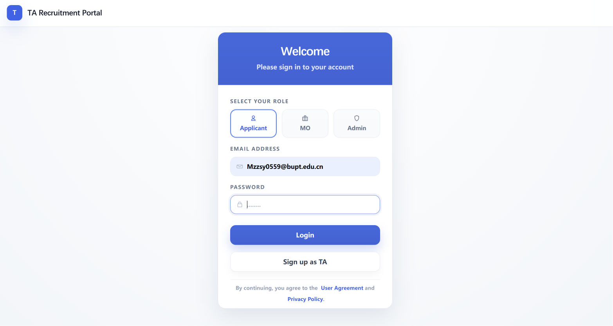

*图 3-1：系统登录页面，支持 TA / MO / Admin 三种角色登录*

### 3.2 注册 (仅 TA)

- **入口：** 登录页面底部的 "Register as TA" 链接。
- **必填字段：** 用户名、邮箱、密码 (含强度校验)、确认密码。
- **可选字段：** 姓名、学号、专业、年级、电话、个人简介。
- **技能标签：** 从预置技能列表中选择 (Java、Python、Git、Testing、Communication、SQL、Machine Learning、Data Analysis)，支持多选。
- **校验规则：**
  - 用户名不能重复
  - 邮箱格式校验
  - 两次密码必须一致
  - 密码建议至少 8 位
- **完成后：** 自动登录并跳转到 TA Dashboard。

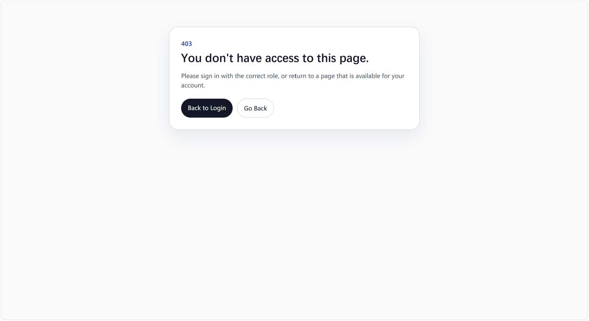

*图 3-2：TA 注册页面，包含基本信息、技能标签选择与密码强度校验*

### 3.3 登出

- **位置：** 页面右上角用户头像/用户名区域，点击 "Logout"。
- **行为：** 销毁当前 Session，重定向到登录页。

### 3.4 通知系统

系统支持 **7 种通知类型**，通过页面右上角铃铛图标展示，未读数量以红点标记：

| 通知类型 | 接收者 | 触发场景 | 需操作 |
|----------|--------|----------|:---:|
| `NEW_APPLICATION` | MO | TA 提交了新申请 | ❌ |
| `APPLICATION_ACCEPTED` | TA | MO 接受了申请 | ❌ |
| `APPLICATION_REJECTED` | TA | MO 拒绝了申请 | ❌ |
| `APPLICATION_AUTO_WITHDRAWN` | TA | MO 编辑岗位导致申请级联撤回 | ❌ |
| `REVOCATION_REQUEST` | MO | TA 对已接受的岗位提交撤销请求 | ✅ (接受/拒绝) |
| `REVOCATION_APPROVED` | TA | MO 批准了撤销请求 | ❌ |
| `REVOCATION_REJECTED` | TA | MO 拒绝了撤销请求 | ❌ |

**通知交互：**
- 点击铃铛图标展开通知列表。
- 每条通知显示标题、消息内容和时间。
- 点击通知旁的关闭按钮可标记为已读并移除。
- 需要操作的通知 (如撤销请求) 会在通知卡片中直接显示 "Approve" / "Reject" 按钮。

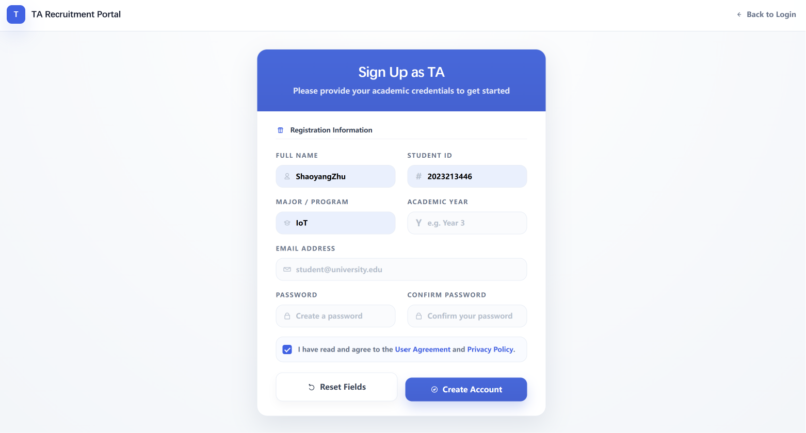

*图 3-3：通知系统，点击铃铛图标展开通知列表，支持已读标记和行内操作*

### 3.5 页面布局

系统采用统一的布局系统：

```
┌──────────────────────────────────────────────┐
│  Header: Logo | 导航 | 通知铃铛 | 用户信息     │
├────────┬─────────────────────────────────────┤
│        │                                     │
│ Sidebar│  Main Content Area                  │
│ (可选) │  (JSP 页面主体)                      │
│        │                                     │
├────────┴─────────────────────────────────────┤
│  Footer: 版权信息 | 法律条款链接               │
└──────────────────────────────────────────────┘
```

- **布局模板：** `web/WEB-INF/views/common/layout.jsp`
- **侧边栏：** `sidebar.jsp` -- 根据角色动态展示不同导航项
- **CSS 资源：** `web/assets/css/` 下包含 base.css、layout.css、components.css 及页面专用样式

### 3.6 Toast 消息反馈

系统使用 Toast 组件提供操作结果的即时反馈：

- **成功 Toast：** 绿色样式，用于操作成功 (如 "Profile saved"、"Application submitted")。
- **错误 Toast：** 红色样式，用于操作失败 (如 "Upload failed: invalid PDF")。
- **位置：** 页面右上角，自动淡入淡出。
- **实现：** 通过 `FlashMessages` 工具类在 Session 中暂存消息，JSP 页面渲染时读取并展示。

### 3.7 分页

系统中多个列表页面支持分页功能：

- **默认每页：** 10 条记录 (TA 申请列表为 6 条)。
- **分页参数：** `page` (页码) 和 `size` (每页数量)。
- **UI 展示：** 页面底部显示 "Showing X-Y of Z" 和页码导航按钮。
- **实现类：** `com.bupt.ta.dto.PageResult` 封装分页数据。

---

## 4. TA 用户手册

### 4.1 TA 仪表盘 (Dashboard)

**访问路径：** 登录后自动跳转，或 `/ta/dashboard`

仪表盘是 TA 用户的工作中心，包含以下模块：

#### 4.1.1 个人信息卡片

展示 TA 的基本信息：
- 姓名、学号、专业、年级
- 简历上传状态 (已上传/未上传)，附带文件名和上传时间
- 点击 "Edit Profile" 可跳转至个人资料编辑页

#### 4.1.2 申请统计

三个统计卡片：
- **Pending (待审核)：** 状态为 SUBMITTED 或 REVOCATION_REQUESTED 的申请数
- **Accepted (已接受)：** 被 MO 接受的申请数
- **Rejected (已拒绝)：** 被 MO 拒绝的申请数

#### 4.1.3 最近申请

展示最近的 3 条申请记录，包括：
- 岗位名称和课程编号
- 申请状态 (带颜色标签)
- 申请时间
- 匹配分数

#### 4.1.4 推荐岗位

展示最近 3 个未申请的开放岗位：
- 岗位名称、课程编号
- 截止日期
- 匹配分数预览
- 点击可查看详情并申请

#### 4.1.5 课程表/日程

展示当前周的 TA 工作安排：
- **课程 TA 分配：** 已接受岗位的固定教学时段 (来自 `ta-timetable.json`)
- **活动事件：** 一次性活动岗位 (监考、项目评审等) 的日期、时间、地点
- 无接受岗位时显示 "No ongoing TA assignment"

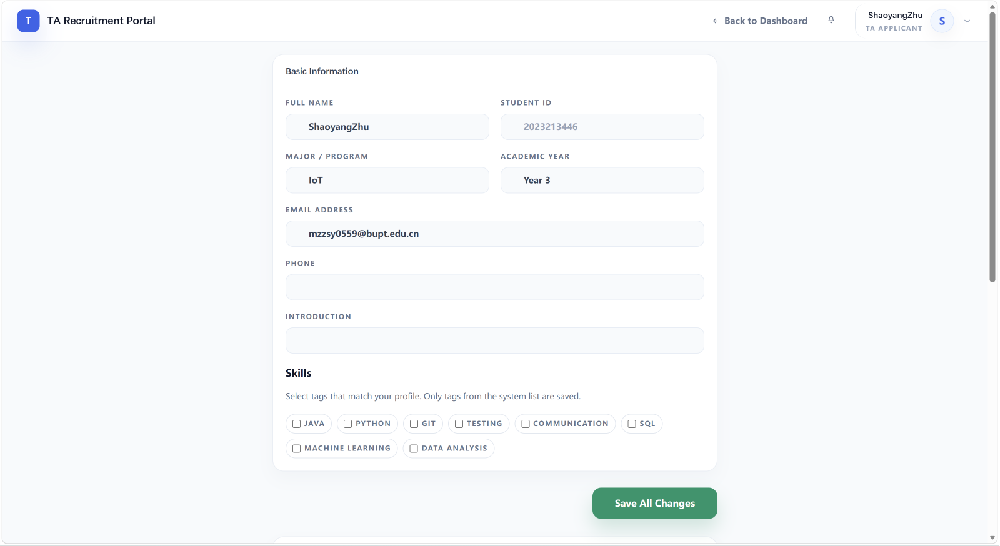

*图 4-1：TA 仪表盘，展示个人信息、申请统计、最近申请、推荐岗位和课程表*

### 4.2 个人资料管理

**访问路径：** `/ta/profile`

#### 4.2.1 基本信息编辑

可编辑的字段：
- 姓名 (Full Name)
- 学号 (Student ID)
- 邮箱 (Email)
- 电话 (Phone)
- 专业 (Major Program)
- 年级 (Academic Year)
- 个人简介 (Intro) -- 多行文本

#### 4.2.2 技能标签管理

- 从预置技能列表中选择多个技能
- 当前预置技能：Java、Python、Git、Testing、Communication、SQL、Machine Learning、Data Analysis
- 选中的技能以标签 (tag) 形式展示
- 保存后技能信息将用于岗位匹配分析

#### 4.2.3 简历上传

**上传流程：**

```
TA 选择 PDF 文件
    │
    ▼
文件校验 ──┤ 格式: 仅 .pdf
           │ 大小: ≤ 5MB
           │ 内容: 非空
    │
    ▼ (校验通过)
保存到 data/resumes/{TA_ID}_{timestamp}_resume_{原始文件名}.pdf
    │
    ▼
PDFBox 提取文本 ──┤ 失败 → 保留原始文件, 显示警告
                  │ 成功 → 继续
    │
    ▼
简历结构化处理 ──┤ 提取: name, email, phone,
                   │       education, skills,
                   │       experienceHighlights, rawText
    │
    ▼
写入 data/users/ta.json 的 extractedResume 字段
    │
    ▼
页面刷新, 显示成功 Toast 和结构化简历信息
```

**简历展示：**
上传成功后，profile 页面会展示：
- 简历文件名
- 上传时间
- 结构化简历信息 (姓名、邮箱、电话、学历、技能列表、经历亮点)
- 原始文本预览
- 下载按钮

**重新上传：** 支持覆盖已有简历，旧文件保留在磁盘但数据库指向新文件。

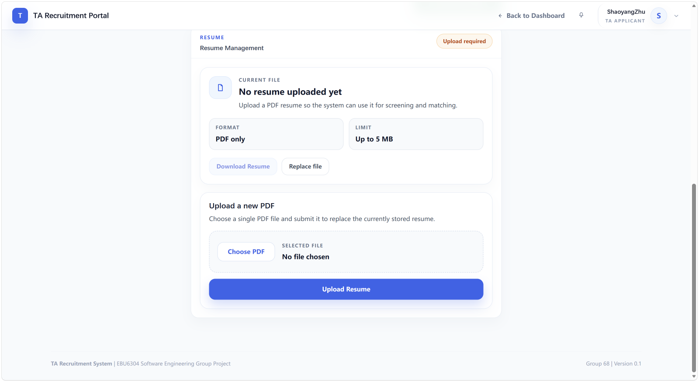

*图 4-2：TA 个人资料页面，支持编辑基本信息、管理技能标签和上传 PDF 简历*

#### 4.2.4 简历下载

- 点击 "Download Resume" 按钮，下载已上传的 PDF 原始文件。
- 对应接口：`GET /ta/resume/download`

### 4.3 岗位浏览

**访问路径：** `/ta/jobs`

#### 4.3.1 搜索与筛选

系统提供多维度搜索和筛选：

| 筛选项 | 参数名 | 说明 |
|--------|--------|------|
| 关键词搜索 | `keyword` | 搜索岗位名称、课程编号、描述 |
| 专业筛选 | `major` | 按相关专业筛选 |
| 部门筛选 | `department` | 按院系部门筛选 |
| 模块类型 | `moduleType` | 课程 TA / 活动 (Activity) |
| 职责关键词 | `responsibilityKeyword` | 搜索职责描述 |

#### 4.3.2 排序

| 排序选项 | 参数值 | 说明 |
|----------|--------|------|
| 最新发布 | `latest` (默认) | 按发布时间倒序 |
| 截止日期近 | `deadline-asc` | 截止日期从近到远 |
| 匹配度从高到低 | `match-desc` | 按智能匹配分数降序 |
| 岗位名称 A-Z | `name-asc` | 按名称字母排序 |

#### 4.3.3 岗位卡片列表

每个岗位卡片显示：
- 课程编号和岗位名称
- MO 姓名
- 开放状态和截止日期
- 空缺人数 (Vacancies)
- 预估工时 (Estimated Workload Hours)
- 匹配分数标签 (Strong Match / Moderate Match / Weak Match)
- 所需技能列表 (标签展示)
- 岗位类型 (TA / Activity)
- "View Details" 按钮

已申请的岗位会在卡片上显示 "Already Applied" 标记。

#### 4.3.4 空状态

当无匹配岗位时，显示空状态提示：
- "No open positions match your current filters."
- 建议清除筛选条件或完善简历以提高匹配结果。

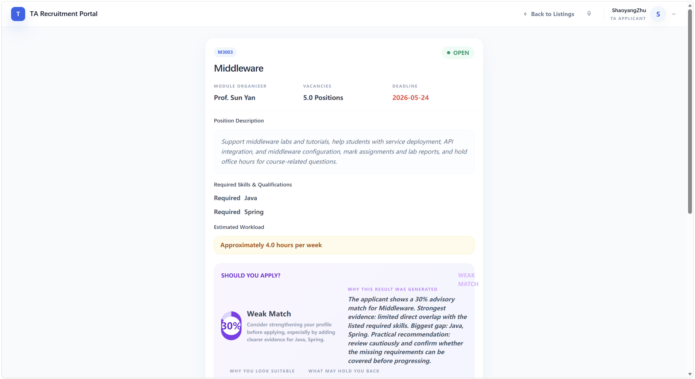

*图 4-3：岗位浏览页面，支持关键词搜索、多条件筛选和多种排序方式*

### 4.4 岗位详情与智能匹配

**访问路径：** `/ta/jobs/detail?jobId=POST001`

#### 4.4.1 岗位信息

完整展示岗位详情：
- 课程编号、课程名称
- MO 姓名
- 岗位描述 (职责详情)
- 所需技能列表
- 空缺人数
- 预估工时
- 截止日期
- 岗位类型 (TA / Activity)
- 对于 Activity 类型，额外展示：活动类型、日期、开始/结束时间、地点

#### 4.4.2 智能匹配分析

系统自动将 TA 的简历与该岗位进行匹配分析，展示：

**匹配分数区域：**
- 大号百分比分数 (0-100)
- 匹配等级标签：
  - `Strong Match` (≥ 80%) -- 绿色
  - `Moderate Match` (60-79%) -- 黄色
  - `Weak Match` (< 60%) -- 橙色/红色

**分析详情：**
- **Strength Summary (优势摘要)：** 最匹配的技能证据
- **Matched Skills (已匹配技能)：** 与岗位要求重合的技能列表
- **Risk Summary (风险提示)：** 缺失或不明确的技能
- **Missing Skills (缺失技能)：** 简历中未体现的岗位要求技能
- **Next Step Suggestion (下一步建议)：** 基于分数给出的操作建议
- **Confidence Hint (置信度提示)：** 说明匹配结果的可靠性
- **Method Label (匹配方法)：** AI-assisted review / Rule-based review / Fallback rule review

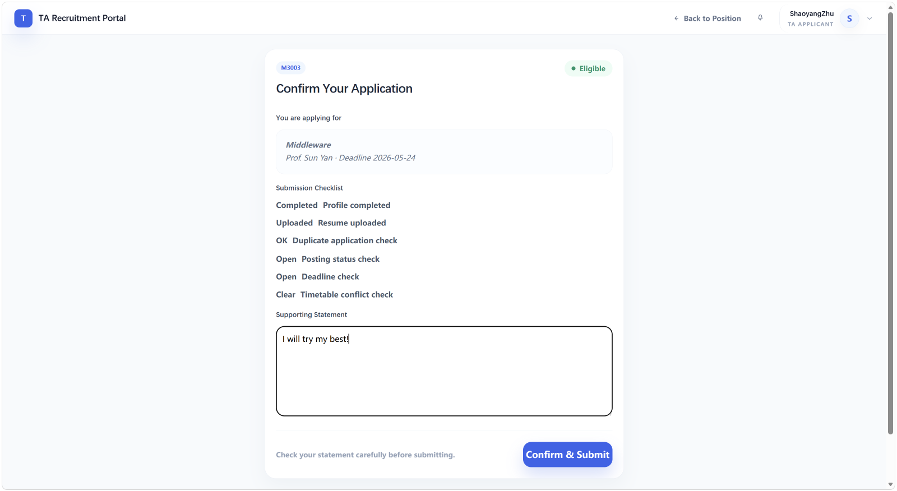

*图 4-4：岗位详情页面，展示完整的岗位信息和智能匹配分析结果*

#### 4.4.3 申请入口

岗位详情页底部提供 "Apply Now" 按钮：
- 已申请的岗位显示 "Already Applied"，不可重复申请
- 点击后进入申请确认页面

### 4.5 申请流程

#### 4.5.1 申请确认页

**访问路径：** `/ta/applications/confirm?jobId=POST001`

确认页展示：
- 岗位信息摘要
- 匹配分数摘要
- 申请前的检查清单 (Checklist)：
  - [ ] 我已阅读岗位要求
  - [ ] 我已上传最新简历
  - [ ] 我的技能与岗位要求匹配
  - [ ] 我能按时完成该岗位的职责
- **个人陈述 (Statement)：** 可选填写一段自我陈述，说明申请动机和优势
- **时间冲突检测：** 系统自动检查与已接受岗位的时间冲突 (基于 `ta-timetable.json`)
  - 如有冲突，页面会显示警告信息
- 操作按钮："Submit Application" / "Cancel"

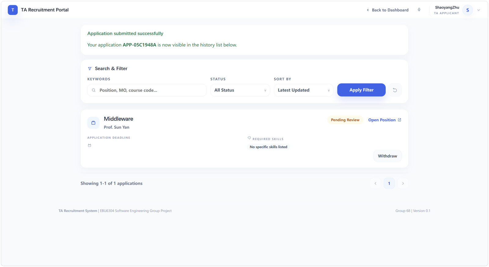

*图 4-5：申请确认页面，展示岗位信息、匹配分数、检查清单和个人陈述输入框*

#### 4.5.2 提交申请

**访问路径：** `POST /ta/applications/submit`

提交后系统执行：
1. 校验申请合法性 (岗位存在且开放、未重复申请)
2. 记录申请时间
3. 执行智能匹配分析并将结果存储到申请记录
4. 更新岗位的 `applicationCount`
5. 向 MO 发送 `NEW_APPLICATION` 通知
6. 跳转到 "My Applications" 页面并显示成功 Toast

### 4.6 我的申请

**访问路径：** `/ta/applications/my`

#### 4.6.1 申请列表

列表展示所有申请记录，每条包含：
- 申请 ID
- 岗位名称和课程编号
- MO 姓名
- 申请时间
- 当前状态 (SUBMITTED / UNDER_REVIEW / ACCEPTED / REJECTED / WITHDRAWN / REVOCATION_REQUESTED)
- 匹配分数
- 状态标签颜色：
  - Pending Review: 蓝色
  - Accepted: 绿色
  - Rejected: 红色
  - Withdrawn: 灰色
  - Revocation Requested: 橙色

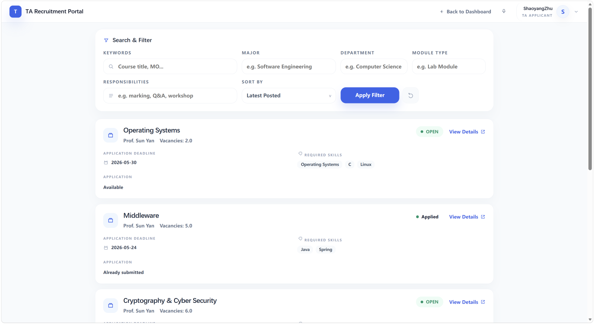

*图 4-6：我的申请列表页面，展示所有申请记录及其状态、匹配分数和操作按钮*

#### 4.6.2 申请详情 (行内展开)

点击某条申请可展开详情：
- 完整的岗位信息
- 个人陈述
- MO 反馈 (如有)
- 匹配分析详情 (分数、已匹配/缺失技能、解释)
- 操作按钮 (根据状态不同)

#### 4.6.3 撤回申请 (Withdraw)

- **适用状态：** SUBMITTED (待审核)
- **操作：** 点击 "Withdraw" 按钮，确认后执行
- **效果：**
  - 申请状态变更为 WITHDRAWN
  - 岗位 `applicationCount` 减 1
  - 操作不可逆

#### 4.6.4 申请撤销 (Revocation Request)

- **适用状态：** ACCEPTED (已接受)
- **流程：**
  1. 点击 "Request Revocation" 按钮
  2. 输入撤销原因 (必填)
  3. 确认后，申请状态变更为 REVOCATION_REQUESTED
  4. MO 收到 `REVOCATION_REQUEST` 通知 (需操作)
  5. 等待 MO 审批：
     - 若 MO 批准：状态变为 WITHDRAWN，释放课表时段，TA 收到 `REVOCATION_APPROVED` 通知
     - 若 MO 拒绝：状态恢复为 ACCEPTED，TA 收到 `REVOCATION_REJECTED` 通知

### 4.7 完整操作示例

**场景：** 新 TA 用户完成注册、上传简历、浏览岗位并提交申请。

1. **注册账号**
   - 访问 `/auth/login`，点击 "Register as TA"
   - 填写用户名 `zhangsan`、邮箱、密码
   - 选择技能标签：Java, Python, Git
   - 点击 "Register"，自动登录进入 Dashboard

2. **完善资料与上传简历**
   - 在 Dashboard 点击 "Edit Profile"
   - 补充姓名 "Zhang San"、学号 "2023210001"、专业 "Computer Science"
   - 在简历区域选择本地 PDF 简历文件上传
   - 系统自动提取简历信息并展示
   - 点击 "Save Profile" 保存

3. **浏览岗位**
   - 导航到 "Browse Positions" (`/ta/jobs`)
   - 在搜索框输入 "software"，筛选出软件工程相关岗位
   - 按 "Match Score" 排序，查看最匹配的岗位

4. **查看岗位详情**
   - 点击 "Software engineering" (POST001) 的 "View Details"
   - 查看岗位描述和所需技能
   - 查看智能匹配分析：分数 57%，Moderate Match
   - 阅读匹配说明和缺失技能建议

5. **提交申请**
   - 点击 "Apply Now" 进入确认页
   - 勾选所有检查项
   - 填写个人陈述："I have strong Java skills and previous TA experience."
   - 点击 "Submit Application"
   - 系统提示 "Application submitted successfully"

6. **查看申请状态**
   - 导航到 "My Applications"
   - 查看刚提交的申请，状态为 "Pending Review"
   - 等待 MO 审核

---

## 5. MO 用户手册

### 5.1 MO 仪表盘 (Dashboard)

**访问路径：** `/mo/dashboard`

MO 仪表盘展示该 MO 负责的招聘工作概览：

#### 5.1.1 个人信息卡片

- MO 姓名、工号、部门
- 联系邮箱和电话
- "Edit Profile" 入口

#### 5.1.2 关键指标

- **Awaiting Review (待审核申请数)：** 所有名下岗位中状态为 SUBMITTED 的申请总数
- **Active Postings (活跃岗位数)：** 状态为 OPEN 的岗位数
- **Deadline Alerts (截止提醒)：** 3 天内截止的开放岗位预警

#### 5.1.3 活跃岗位列表

展示该 MO 的所有 OPEN 岗位：
- 课程编号、课程名称
- 空缺人数 / 已申请人数
- 截止日期
- 点击可查看申请人列表或编辑岗位

#### 5.1.4 最近活动

展示最近 5 条与该 MO 相关的活动：
- 新申请提交
- 岗位创建/更新
- 申请审核结果
- 每条活动显示时间、相关岗位、TA 姓名

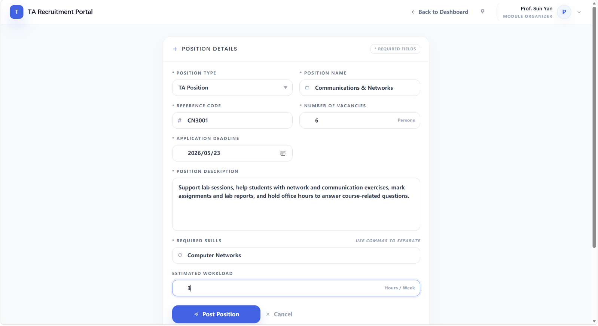

*图 5-1：MO 仪表盘，展示个人信息、关键指标、活跃岗位列表和最近活动*

### 5.2 岗位管理

**访问路径：** `/mo/jobs` (列表), `/mo/jobs/create` (创建), `/mo/jobs/edit?jobId=xxx` (编辑)

#### 5.2.1 岗位列表

展示该 MO 创建的所有岗位，支持：
- 状态筛选 (Open / Closed / All)
- 关键词搜索
- 排序 (发布时间、截止日期、名称)
- 分页浏览

每个岗位卡片操作按钮：
- **View Applicants：** 查看申请人列表
- **Edit：** 编辑岗位信息
- **Close / Reopen：** 关闭或重新开放岗位

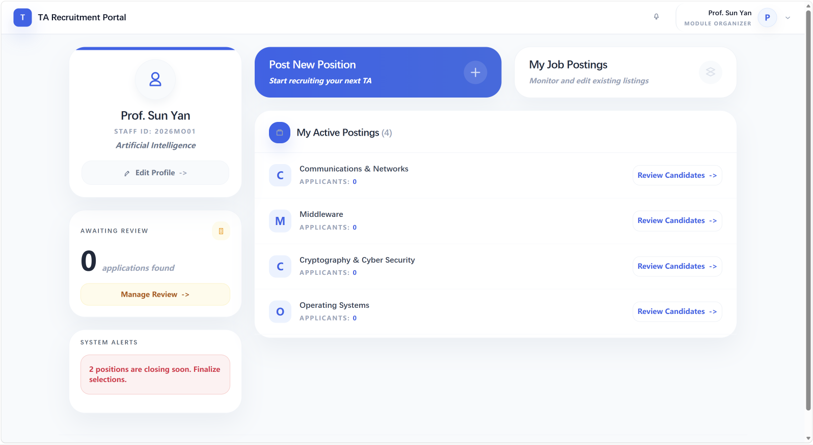

*图 5-2：MO 岗位管理列表，展示所有岗位并支持搜索、筛选和排序*

#### 5.2.2 创建岗位

**表单字段：**

| 字段 | 类型 | 必填 | 说明 |
|------|------|:---:|------|
| Course Code | 文本 | ✅ | 课程编号，如 X5414 |
| Course Name | 文本 | ✅ | 课程/岗位名称 |
| Description | 多行文本 | ✅ | 岗位详细描述 |
| Required Skills | 多选标签 | ✅ | 所需技能 (从预置列表选择或手动输入) |
| Vacancies | 数字 | ✅ | 空缺人数 |
| Estimated Workload Hours | 数字 | ✅ | 预估工时 (每周) |
| Deadline | 日期 | ✅ | 申请截止日期 |
| Posting Type | 下拉 | ✅ | TA (课程助教) / ACTIVITY (活动) |

**仅当 Posting Type = ACTIVITY 时显示的字段：**

| 字段 | 类型 | 必填 | 说明 |
|------|------|:---:|------|
| Activity Type | 下拉 | ✅ | project-assessment / invigilation / lab-support / other |
| Activity Date | 日期 | ✅ | 活动日期 |
| Start Time | 时间 | ✅ | 开始时间 |
| End Time | 时间 | 可选 | 结束时间 |
| Location | 文本 | ✅ | 活动地点 |

创建后岗位状态默认为 OPEN，TA 用户即可看到并申请。

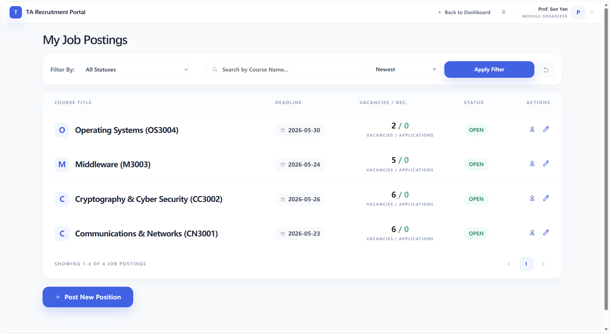

*图 5-3：创建岗位表单，包含课程信息、所需技能、空缺人数等必填字段*

#### 5.2.3 编辑岗位

编辑页面与创建页面表单一致，额外展示：
- 岗位 ID
- 创建时间和最后更新时间
- 当前申请人数

**级联撤回 (Cascade Withdrawal)：**
当 MO 编辑岗位的关键信息 (岗位描述或所需技能) 时，系统会自动：
1. 将所有已提交的申请 (SUBMITTED 状态) 撤回为 WITHDRAWN
2. 岗位 `applicationCount` 归零
3. 向受影响的 TA 发送 `APPLICATION_AUTO_WITHDRAWN` 通知
4. 通知中说明："Your application was automatically withdrawn because the module organizer updated the posting. Please review the new requirements and reapply if you remain eligible."

> **注意：** 仅修改描述或技能字段时触发级联撤回。修改截止日期、空缺人数等非核心字段不会触发。

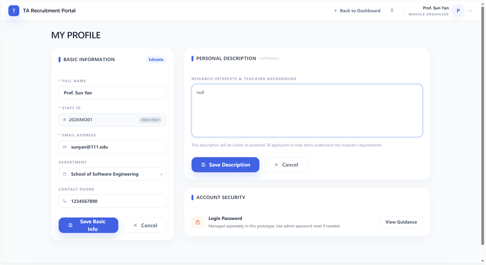

*图 5-4：编辑岗位页面，表单与创建时一致，额外展示岗位 ID 和当前申请人数*

### 5.3 申请审核

**访问路径：** `/mo/jobs/applicants?jobId=POST001` (申请人列表), `/mo/applicants/detail?applicationId=APP001` (申请详情)

#### 5.3.1 申请人列表

针对单个岗位展示所有申请人：

**列表信息：**
- TA 姓名和邮箱
- 申请时间
- 匹配分数 (带颜色标签)
- 匹配等级 (Strong / Moderate / Weak)
- 申请状态
- 行内操作按钮：Accept / Reject / View Details

**排序：**
- 默认按匹配分数降序排列，帮助 MO 优先查看高匹配度申请人

**行内决策：**
- 直接在列表行上点击 "Accept" 或 "Reject"
- 可选填写审核备注 (Feedback)
- 决策即时生效，向 TA 发送对应通知
- 列表实时刷新状态

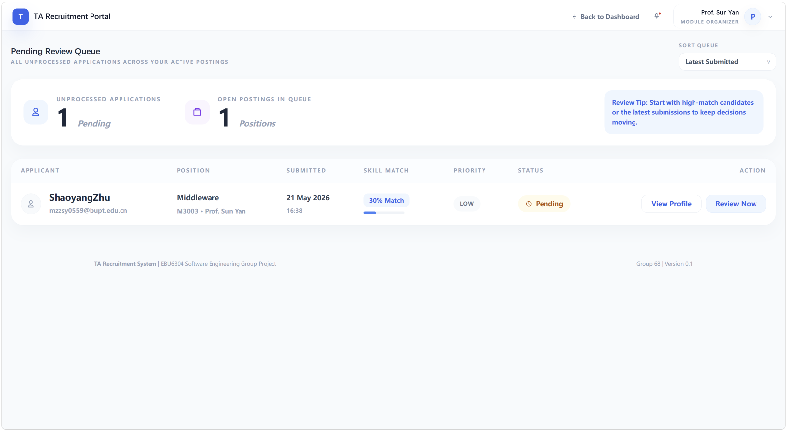

*图 5-5：申请人列表页面，按匹配分数排序，支持行内 Accept/Reject 决策*

#### 5.3.2 申请详情

点击 "View Details" 进入申请详情页面，展示：

**申请人信息：**
- 姓名、学号、邮箱、电话
- 专业、年级
- 个人简介

**岗位信息：**
- 岗位名称、课程编号
- 岗位描述、所需技能

**匹配分析：**
- 匹配分数 (大号显示)
- 匹配等级标签
- Strength Summary (优势摘要)
- Matched Skills (已匹配技能列表)
- Risk Summary (风险提示)
- Missing Skills (缺失技能列表)
- Skill Match Explanation (完整匹配解释)
- Method Label (匹配方法来源)
- Confidence Hint (置信度提示)

**简历下载：**
- 提供 PDF 原始简历下载链接
- MO 可结合 AI 匹配结果和原始简历做出综合判断

**审核操作：**
- Accept 按钮：接受申请，状态变为 ACCEPTED
- Reject 按钮：拒绝申请，状态变为 REJECTED
- Feedback 输入框：审核意见 (可选，会展示给 TA)

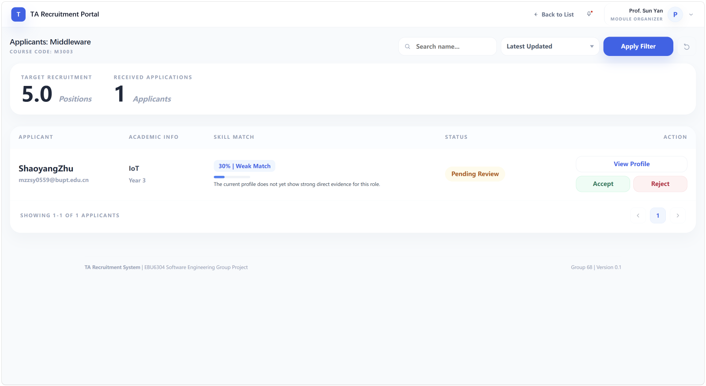

*图 5-6：申请详情页面，展示申请人信息、匹配分析、简历下载和审核操作*

### 5.4 审核队列 (Review Queue)

**访问路径：** `/mo/review-queue`

审核队列汇总该 MO 所有名下岗位的待审核申请 (SUBMITTED 状态)：

**队列概览：**
- Pending 申请总数
- 涉及的岗位数
- 按申请时间倒序排列

**每条申请显示：**
- TA 姓名和邮箱
- 岗位名称和课程编号
- 匹配分数
- 优先级标签：
  - High (匹配分数 ≥ 80) -- 红色高亮
  - Medium (匹配分数 60-79) -- 黄色
  - Low (匹配分数 < 60) -- 绿色
- 提交时间 (日期 + 时间)
- 操作按钮：View Details

**用途：**
- 适合 MO 集中批量审核所有待处理申请
- 不需要逐个进入岗位查看
- 优先级标签帮助 MO 快速定位高匹配度申请人

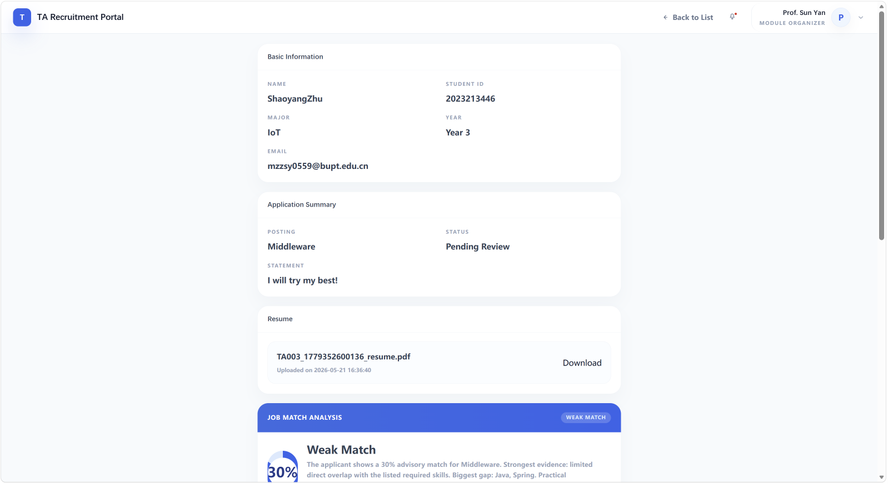

*图 5-7：审核队列页面，汇总所有待审核申请并按优先级标注*

### 5.5 撤销请求处理 (Revocation Handling)

**触发场景：** TA 对已接受的岗位提交撤销请求。

**处理流程：**

```
TA 提交撤销请求 (填写原因)
    │
    ▼
申请状态 → REVOCATION_REQUESTED
    │
    ▼
MO 收到 REVOCATION_REQUEST 通知 (requiresAction = true)
    │
    ▼
MO 在通知弹窗中查看请求详情
    │
    ├─→ Approve (批准)
    │     │
    │     ▼
    │   申请状态 → WITHDRAWN
    │   岗位 applicationCount 减 1
    │   释放 TA 课表时段 (ta-timetable.json)
    │   TA 收到 REVOCATION_APPROVED 通知
    │
    └─→ Reject (拒绝)
          │
          ▼
        申请状态恢复 → ACCEPTED
        TA 收到 REVOCATION_REJECTED 通知
        TA 继续担任该岗位助教
```

MO 也可以在通知列表中看到所有待处理的撤销请求，通过通知卡片的 Approve/Reject 按钮直接处理。

### 5.6 MO 个人资料管理

**访问路径：** `/mo/profile`

可编辑的字段：
- 姓名 (Full Name)
- 工号 (Staff ID)
- 邮箱 (Email)
- 电话 (Phone)
- 部门 (Department)
- 个人描述 (Description)

### 5.7 完整操作示例

**场景：** MO 创建新岗位并审核收到的申请。

1. **查看仪表盘**
   - 登录后进入 `/mo/dashboard`
   - 查看待审核申请数: 3
   - 查看截止提醒: 1 个岗位即将截止

2. **创建新岗位**
   - 导航到 "My Postings" (`/mo/jobs`)
   - 点击 "Create New Position"
   - 填写表单:
     - Course Code: EBU6304
     - Course Name: Software Engineering Lab TA
     - Description: Assist with weekly lab sessions...
     - Required Skills: Java, Git, Communication, Testing
     - Vacancies: 4
     - Workload Hours: 5
     - Deadline: 2026-06-01
     - Posting Type: TA
   - 点击 "Publish"，岗位发布成功

3. **查看申请人**
   - 在岗位列表点击某岗位的 "View Applicants"
   - 申请人列表按匹配分数排序
   - 查看最高分申请人: 85% Strong Match

4. **审核申请**
   - 点击 "View Details" 进入申请详情
   - 查看匹配分析: 已匹配 Java, Git, Communication
   - 下载 PDF 简历查看原始内容
   - 阅读 AI 匹配解释和风险提示
   - 综合判断后点击 "Accept"
   - 填写 Feedback: "Excellent match. Welcome aboard!"
   - TA 即时收到接受通知

5. **处理撤销请求**
   - 通知铃铛显示红色数字
   - 展开通知列表，看到 "Revocation request"
   - 查看请求详情: TA 因课程冲突请求撤销
   - 点击 "Approve"
   - TA 收到撤销批准通知，岗位空缺恢复

---

## 6. Admin 用户手册

### 6.1 Admin 仪表盘 (系统概览)

**访问路径：** `/admin/dashboard`

Admin 仪表盘提供全局系统运行状态的概览：

#### 6.1.1 关键指标卡片

| 指标 | 说明 |
|------|------|
| Total TAs | 系统中注册的 TA 总数 |
| Total MOs | 系统中注册的 MO 总数 |
| Total Postings | 所有 MO 创建的岗位总数 |
| Open Postings | 当前开放的岗位数 |
| Pending Applications | 待审核的申请总数 |
| Active Recruitments | 活跃招聘流程数 (未截止的开放岗位) |

#### 6.1.2 最近活动

展示最近 8 条系统级活动：
- TA 注册
- MO 账号创建
- 新岗位发布
- 新申请提交
- 按时间倒序排列，显示活动类型、消息、时间

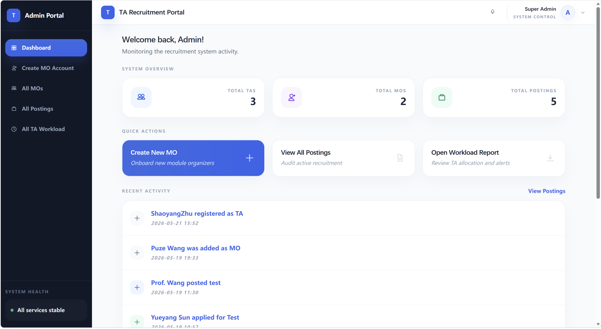

*图 6-1：Admin 系统概览仪表盘，展示关键指标和最近活动*

### 6.2 MO 账号管理

**访问路径：** `/admin/mos` (列表), `/admin/mos/create` (创建), `/admin/mos/detail?moId=xxx` (详情)

#### 6.2.1 MO 列表

展示系统中所有 MO 账号：
- 姓名、工号、邮箱、部门
- 岗位数 (该 MO 创建的岗位数量)
- 操作按钮: View Details

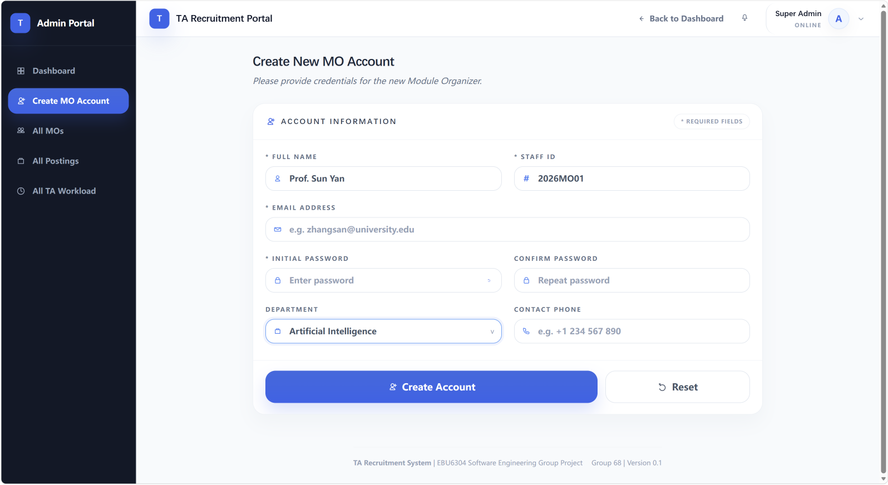

*图 6-2：MO 账号管理页面，支持搜索、筛选，展示所有 MO 及其岗位数*

#### 6.2.2 创建 MO 账号

Admin 可以为新的课程组织者创建账号：

**表单字段：**

| 字段 | 类型 | 必填 | 说明 |
|------|------|:---:|------|
| Username | 文本 | ✅ | 登录用户名 |
| Full Name | 文本 | ✅ | 姓名 |
| Staff ID | 文本 | ✅ | 工号 |
| Email | 文本 | ✅ | 邮箱 |
| Phone | 文本 | 可选 | 电话 |
| Department | 文本 | 可选 | 院系部门 |
| Password | 密码 | ✅ | 初始密码 |

创建后 MO 即可用该账号登录系统。

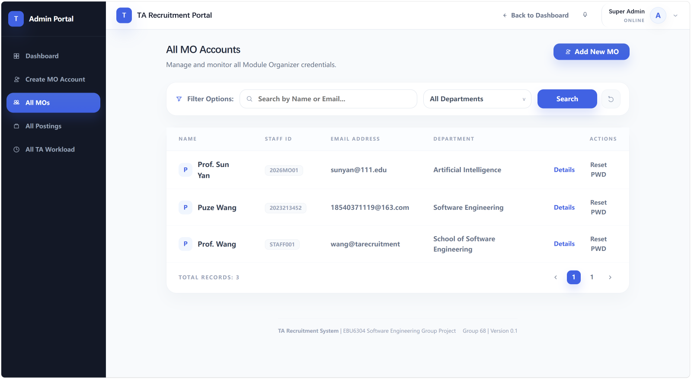

*图 6-3：创建 MO 账号表单，包含用户名、姓名、工号、邮箱等必填字段*

#### 6.2.3 MO 详情

**访问路径：** `/admin/mos/detail?moId=MO001`

展示 MO 的详细信息：
- 基本信息 (姓名、工号、邮箱、部门、电话)
- 创建的岗位列表
- 每个岗位的申请数
- 状态 (Active / Inactive)

**密码重置：**
- 在详情页提供 "Reset Password" 功能
- 输入新密码后即时生效
- 对应接口: `POST /admin/mos/password-reset`

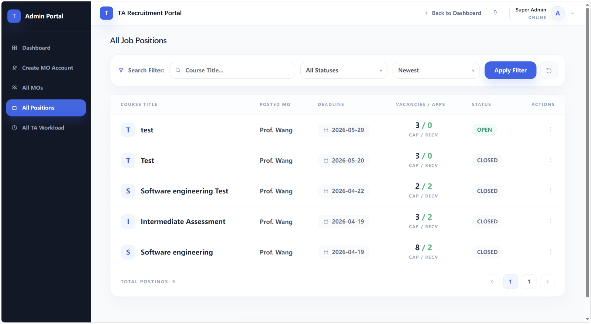

*图 6-4：MO 详情页面，展示基本信息、创建的岗位列表及密码重置功能*

### 6.3 全局岗位监控

**访问路径：** `/admin/jobs`

展示系统中所有岗位的汇总视图：
- 课程编号、课程名称
- 所属 MO 姓名
- 状态 (Open / Closed)
- 空缺人数 / 已申请人数
- 截止日期
- 支持按 MO、状态、关键词筛选
- 支持排序 (发布时间、截止日期、申请数)

### 6.4 TA 工作量分析

**访问路径：** `/admin/workload` (列表), `/admin/workload/detail?taId=TA001` (详情)

#### 6.4.1 工作量列表

展示所有 TA 的工作量概况：

| 列 | 说明 |
|----|------|
| TA ID | 用户标识 |
| 姓名 | TA 全名 |
| 学号 | 学生学号 |
| 专业 | 所在专业 |
| 活跃岗位数 | 当前 ACCEPTED 的开放岗位数 |
| 总工时 | 所有已接受岗位的预估工时之和 |
| 负载状态 | NORMAL / HIGH_ALERT / NOT_APPLIED |

**筛选：**
- 关键词搜索 (姓名/学号/TA ID)
- 按专业筛选
- 按负载状态筛选
- 排序: 姓名升序/降序、专业升序/降序、工时升序/降序

**负载状态判定：**
- `NOT_APPLIED`: 无活跃岗位 (工时 = 0)
- `NORMAL`: 总工时 < 12 小时
- `HIGH_ALERT`: 总工时 ≥ 12 小时 (红色预警)

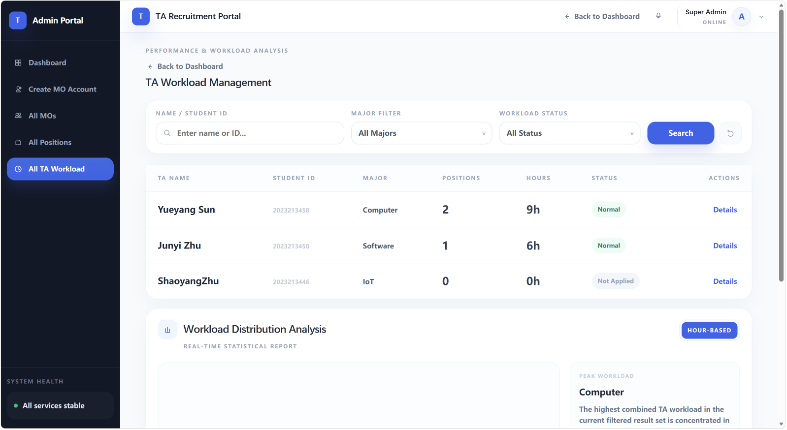

*图 6-5：TA 工作量分析列表，展示各 TA 的活跃岗位数、总工时和负载状态*

#### 6.4.2 TA 工作量详情 (弹窗/页面)

**访问路径：** `/admin/workload/detail?taId=TA001`

展示某位 TA 的详细工作量信息：

**TA 个人信息：**
- 姓名、学号、专业、年级、邮箱、电话

**当前任职岗位列表：**
- 课程编号、课程名称
- 岗位类型 (COURSE_TA / LAB / INVIGILATION / CHECKOFF)
- 工时
- 岗位状态 (ACTIVE / INACTIVE)

**工作量分析：**
- 总工时
- 活跃岗位数
- 高峰工作日 (Peak Day)
- 风险等级: LOW (工时 < 4) / MEDIUM (4-8) / HIGH (≥ 12)
- 状态标签

**管理员建议 (Admin Suggestions)：**
系统根据风险等级自动生成建议：

| 风险等级 | 建议内容 |
|----------|----------|
| HIGH | 避免分配额外任务；与 MO 协调重新分配工作量 |
| MEDIUM | 分配新长时任务前监控工作量趋势；优先分配短时任务 |
| LOW | 可保持当前分配；可承担一项短时运营任务 |
| 无活跃岗位 | 暂无 TA 任务；建议推荐合适的开放岗位 |

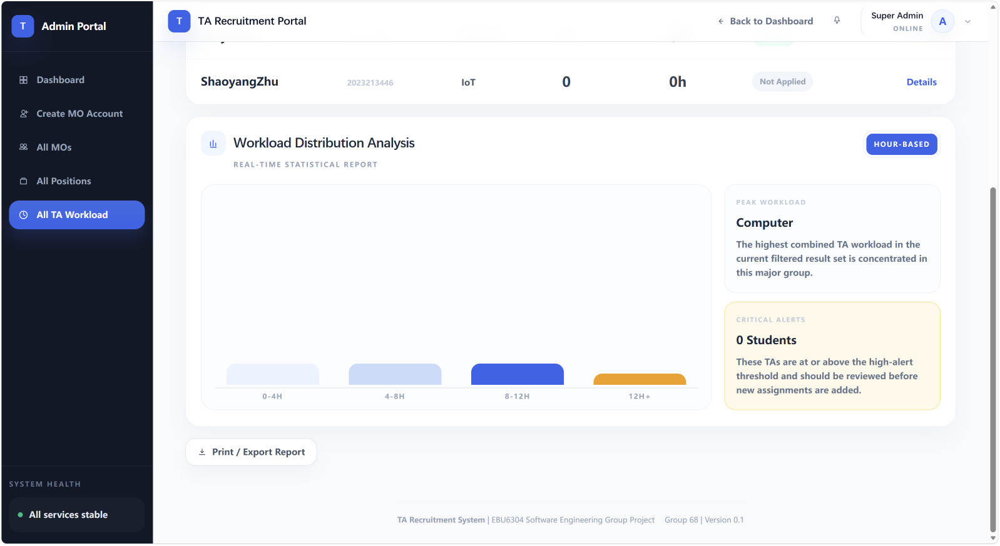

*图 6-6：TA 工作量详情页面，展示个人信息、当前任职岗位、工作量分析和风险等级*

#### 6.4.3 工作量分布图表

页面底部展示 TA 工作量分布统计：

**工时分布桶 (Hour Buckets)：**
- 0-4h: 低工时 TA 人数
- 4-8h: 中等工时 TA 人数
- 8-12h: 较高工时 TA 人数
- 12h+: 高工时预警 TA 人数

**汇总指标：**
- 高工时预警人数 (Critical Alert Count)
- 最高工作量专业组 (Peak Workload Group)

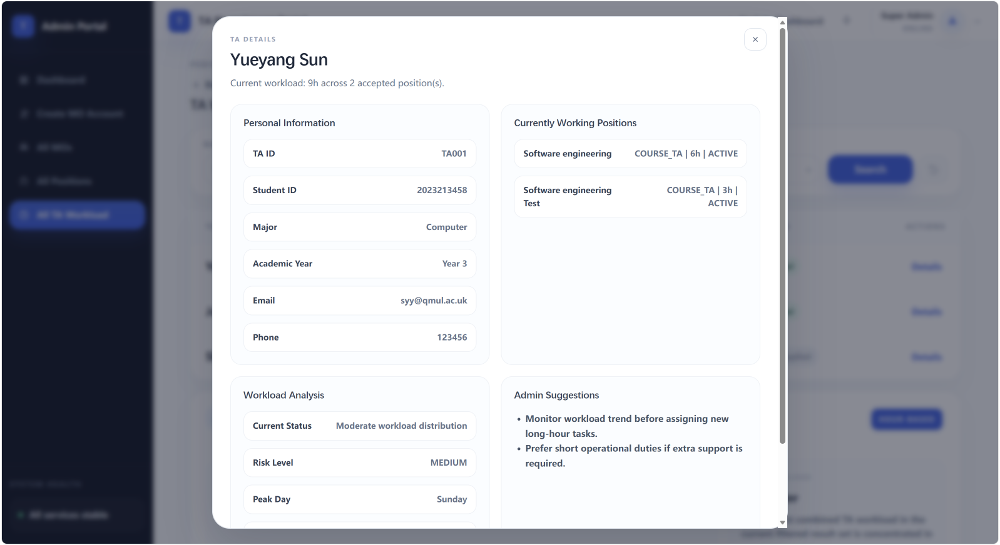

*图 6-7：TA 工作量分布图表，展示工时分布桶和汇总指标*

---

## 7. 智能匹配系统

### 7.1 双引擎架构

系统的智能匹配采用 **双引擎 (Dual Engine)** 架构：

```
┌─────────────────────────────┐
│   RecommendationServiceImpl  │
│                              │
│   检查 LLM 配置完整性?       │
│         │                    │
│    ┌────┴────┐               │
│    │         │               │
│   完整      不完整            │
│    │         │               │
│    ▼         ▼               │
│  OpenAi    Local             │
│  Compatible Rule              │
│  Matcher   Matcher            │
│    │         │               │
│    │    ┌────┴────┐          │
│    │    │         │          │
│   成功  失败    直接返回      │
│    │    │                    │
│    │    ▼                    │
│    │  Fallback 到 Local      │
│    │  Rule Matcher           │
│    │  (method = local-rule-  │
│    │   fallback)             │
│    │                         │
│    ▼                         │
│  统一 MatchResult            │
│  (score, explanation,        │
│   matchedSkills,             │
│   missingSkills, method)     │
└─────────────────────────────┘
```

### 7.2 LLM 评分维度

当 LLM API 配置完整时，系统向 AI 端点发送结构化简历和岗位信息，Prompt 包含以下评分维度：

| 维度 | 说明 |
|------|------|
| 技能重合度 | 简历技能与岗位所需技能的匹配程度 |
| 教育背景相关性 | 学历和专业与岗位的相关性 |
| 教学/学术支持经历 | 是否有助教、辅导、教学相关经验 |
| 岗位职责适配性 | 经历亮点与岗位描述中的职责的匹配 |
| 关键缺口 | 缺失的关键技能或经验 |

**Prompt 约束 (确保可解释性)：**
- 仅基于输入的结构化简历数据和岗位信息做判断
- 不允许补充外部事实或臆测缺失信息
- 必须同时说明支持证据和关键缺口
- 必须标注 "仅供人工决策参考"
- AI 结果不作为自动录用依据

### 7.3 本地规则算法 (Local Rule Matcher)

当 LLM 不可用或未配置时，系统使用本地规则匹配：

**评分公式：**

```
baseScore = 30
skillScore = 55 × (已匹配技能数 / 所需技能总数)
teachingBonus = 10 (简历中包含 "assistant" / "teaching" / "tutor" 关键词)
courseBonus = 5 (简历中包含课程编号或课程名称)

finalScore = min(100, max(0, baseScore + skillScore + teachingBonus + courseBonus))
```

**技能匹配策略：**
1. 精确匹配：技能名称规范化后比较 (统一小写、去除空格和特殊字符)
2. 别名匹配：内置技能别名组
   - QA / Testing / QualityAssurance 互认
   - Lab Support / Lab / LaboratorySupport 互认
   - Tutoring / Tutor / TeachingSupport 互认
   - Marking / Grading / Assessment 互认
3. 包含匹配：一个技能名称包含另一个时视为匹配

### 7.4 匹配结果字段

无论使用哪种匹配引擎，输出格式统一：

| 字段 | 类型 | 说明 |
|------|------|------|
| score | int (0-100) | 匹配分数 |
| explanation | string | 匹配解释 (完整分析文本) |
| method | string | 匹配方法: api-llm / local-rule / local-rule-fallback |
| matchedSkills | string[] | 已匹配的技能列表 |
| missingSkills | string[] | 缺失的技能列表 |

**用户展示辅助字段 (运行时派生，不持久化)：**

| 字段 | 说明 |
|------|------|
| scoreBand | Strong Match (≥80) / Moderate Match (60-79) / Weak Match (<60) |
| strengthSummary | 优势摘要文本 |
| riskSummary | 风险提示文本 |
| nextStepSuggestion | 下一步操作建议 |
| confidenceHint | 结果置信度说明 |
| methodLabel | 匹配方法的用户友好标签 |
| methodHint | 匹配方法的说明文本 |

### 7.5 配置指南

**启用 LLM 匹配：**

1. 复制 `.env.example` 为 `.env.local`
2. 编辑 `.env.local`，填入：

```
LLM_API_URL=https://api.deepseek.com/v1
LLM_API_KEY=your_api_key_here
LLM_MODEL=deepseek-chat
```

3. `.env.local` 已在 `.gitignore` 中，不会被提交
4. 系统启动时自动读取配置

**DeepSeek 兼容性：**
- 支持 `https://api.deepseek.com` 和 `https://api.deepseek.com/v1` 两种格式
- 代码自动补全 `/v1` 后缀

**降级策略：**
- LLM 调用失败时自动降级到本地规则
- 降级结果会标注 `local-rule-fallback`，并在 explanation 中注明原因
- 降级不影响功能完整性，仅影响匹配精度

---

## 8. 系统部署与运维指南

### 8.1 项目目录结构

```
TA-Recruitment-System-Group68/
├── src/
│   └── com/bupt/ta/
│       ├── controller/          # Servlet 控制器
│       │   ├── auth/            # 认证相关
│       │   ├── ta/              # TA 功能
│       │   ├── mo/              # MO 功能
│       │   ├── admin/           # Admin 功能
│       │   └── common/          # 公共控制器
│       ├── service/             # 业务接口
│       │   └── impl/            # 业务实现
│       ├── repository/file/     # 文件数据访问层
│       ├── resume/              # PDF 简历处理
│       ├── match/               # 智能匹配
│       ├── model/               # 数据模型
│       ├── dto/                 # 数据传输对象
│       ├── filter/              # 过滤器
│       ├── exception/           # 自定义异常
│       ├── config/              # 配置与依赖注入
│       └── util/                # 工具类
├── web/                         # Web 前端根目录
│   ├── WEB-INF/
│   │   ├── views/               # JSP 视图
│   │   │   ├── auth/            # 登录/注册页面
│   │   │   ├── ta/              # TA 页面
│   │   │   ├── mo/              # MO 页面
│   │   │   ├── admin/           # Admin 页面
│   │   │   └── common/          # 公共组件页面
│   │   ├── lib/                 # 运行时 JAR 依赖
│   │   └── web.xml              # Web 应用配置
│   ├── assets/
│   │   └── css/                 # 样式表
│   └── index.jsp                # 首页入口
├── data/                        # 数据文件目录
│   ├── users/                   # 用户数据
│   ├── postings/                # 岗位数据
│   ├── applications/            # 申请数据
│   ├── resumes/                 # 上传的简历 PDF
│   ├── notifications/           # 通知数据
│   └── system/                  # 系统辅助数据
├── lib/                         # 编译依赖 JAR
├── scripts/                     # 部署和运行脚本
├── docs/                        # 文档
└── build/                       # 编译输出
```

### 8.2 数据文件说明

| 文件路径 | 格式 | 说明 |
|----------|------|------|
| `data/users/ta.json` | JSON 数组 | TA 用户数据 (含简历提取结果) |
| `data/users/mo.json` | JSON 数组 | MO 用户数据 |
| `data/users/admin.json` | JSON 数组 | Admin 用户数据 |
| `data/postings/postings.json` | JSON 数组 | 所有岗位数据 |
| `data/applications/applications.json` | JSON 数组 | 所有申请记录 |
| `data/notifications/notifications.json` | JSON 数组 | 所有通知记录 |
| `data/system/skill-tags.json` | JSON 数组 | 预置技能标签 |
| `data/system/ta-timetable.json` | JSON 对象 | TA 课表数据 |
| `data/resumes/` | PDF 文件 | 上传的简历原始文件 |

### 8.3 数据备份与恢复

**备份：**

```powershell
# 备份全部数据文件
Copy-Item -Path "{PROJECT_ROOT}\data" -Destination "{BACKUP_PATH}\data_backup_{DATE}" -Recurse
```

**恢复：**

```powershell
# 恢复数据文件
Remove-Item -Path "{PROJECT_ROOT}\data" -Recurse -Force
Copy-Item -Path "{BACKUP_PATH}\data_backup_{DATE}" -Destination "{PROJECT_ROOT}\data" -Recurse
```

> **建议：** 定期备份 data/ 目录，特别是在系统升级或数据迁移前。

### 8.4 环境变量配置

| 变量 | 说明 | 是否必需 |
|------|------|:---:|
| `LLM_API_URL` | AI API 端点 URL | 否 (无则使用本地规则) |
| `LLM_API_KEY` | AI API 密钥 | 否 |
| `LLM_MODEL` | AI 模型名称 | 否 |

配置方式 (任选其一)：
1. 系统环境变量
2. `.env.local` 文件 (项目根目录)

### 8.5 安全注意事项

1. **API 密钥保护：**
   - `.env.local` 已在 `.gitignore` 中
   - 切勿将 API 密钥提交到版本控制
   - 团队协作用 `.env.example` 作为模板

2. **密码安全：**
   - 当前测试环境密码明文存储
   - 生产环境应使用哈希加盐存储 (`PasswordUtils` 已提供基础工具)

3. **会话安全：**
   - Session 超时 30 分钟
   - 登录时旧会话自动失效
   - 生产环境应启用 HTTPS

4. **文件上传安全：**
   - 仅允许 PDF 格式
   - 文件大小限制 5MB
   - 上传文件存储在服务器本地目录

5. **开发调试入口：**
   - `/dev/login-as` 仅用于本地开发
   - 生产部署时应移除或保护该入口

---

## 9. 常见问题解答 (FAQ)

### 登录与认证

**Q: 登录时提示 "Invalid username, password, or role" 怎么办？**
A: 请检查: (1) 用户名是否拼写正确；(2) 密码是否正确 (区分大小写)；(3) 选择的角色是否与账号实际角色匹配。

**Q: 为什么我选择了 MO 角色但无法登录？**
A: MO 账号由 Admin 创建，不能自行注册。请联系 Admin 为你创建 MO 账号。

**Q: Session 多久会过期？**
A: 默认 30 分钟无操作自动过期。过期后需要重新登录。

### TA 用户

**Q: 上传简历时提示 "Invalid file format"？**
A: 系统仅支持 PDF 格式文件。请确认文件后缀为 `.pdf`。

**Q: 简历上传成功但没有提取到信息？**
A: 可能原因: (1) PDF 是扫描件/图片型 PDF，PDFBox 无法提取文本；(2) PDF 使用了特殊字体或加密。建议使用标准文本型 PDF。

**Q: 为什么匹配分数很低？**
A: 匹配分数基于简历中提取的技能与岗位要求的对比。建议: (1) 确保简历中包含相关技能关键词；(2) 完善个人资料中的技能标签；(3) 匹配结果仅供参考，最终由 MO 人工审核。

**Q: 我可以对同一个岗位重复申请吗？**
A: 不可以。系统会检测重复申请，同一 TA 对同一岗位只能提交一次申请。

**Q: 撤回申请后可以重新申请吗？**
A: 可以。撤回后状态变为 WITHDRAWN，你可以重新浏览该岗位并提交新申请。

**Q: 撤销请求 (Revocation Request) 和撤回 (Withdraw) 有什么区别？**
A: Withdraw 用于待审核 (SUBMITTED) 的申请，可立即撤回。Revocation Request 用于已接受 (ACCEPTED) 的申请，需要 MO 审批才能撤销。

### MO 用户

**Q: 编辑岗位时为什么提示 "Applications will be withdrawn"？**
A: 当你修改岗位描述或所需技能时，系统会触发级联撤回，所有已提交的申请将被自动撤回。这是为了保证申请者在更新后的岗位要求下重新评估。

**Q: 匹配分数是最终决定吗？**
A: 不是。匹配分数和 AI 分析仅供参考。MO 应结合原始 PDF 简历和自身判断做出最终审核决定。AI 结果中明确标注了 "Advisory review" 和置信度提示。

**Q: 审核队列中的优先级是如何确定的？**
A: 基于匹配分数: ≥ 80 为 High Priority，60-79 为 Medium，< 60 为 Low。

**Q: 处理撤销请求时，批准和拒绝分别会发生什么？**
A: 批准后：TA 的申请变为 WITHDRAWN，岗位空缺恢复，TA 课表时段释放。拒绝后：TA 的申请恢复为 ACCEPTED，继续担任该岗位助教。

**Q: 我可以关闭已发布的岗位吗？**
A: 可以。在岗位管理列表中可以关闭 (Close) 开放状态的岗位。关闭后 TA 将无法再申请该岗位。也可以重新打开 (Reopen)。

### Admin 用户

**Q: 如何重置 MO 的密码？**
A: 进入 "MO Management" -> 找到目标 MO -> 点击 "View Details" -> 在详情页使用 "Reset Password" 功能。

**Q: TA 工作量分析中的 "HIGH_ALERT" 是什么意思？**
A: 表示该 TA 的总工时达到或超过 12 小时/周，存在过载风险。建议与相关 MO 协调，避免给该 TA 分配更多任务。

**Q: 工作量分布图表的数据来源是什么？**
A: 基于所有 TA 的已接受 (ACCEPTED) 申请及其对应岗位的预估工时汇总计算。

### 数据与安全

**Q: 系统数据存储在哪里？**
A: 所有业务数据以 JSON 文件形式存储在 `data/` 目录下。上传的 PDF 简历存储在 `data/resumes/` 目录。

**Q: 如果数据文件损坏怎么办？**
A: 建议定期备份 `data/` 目录。如文件损坏，可从备份恢复。系统对空的 JSON 数组文件有容错处理。

**Q: AI 匹配会泄露简历数据吗？**
A: 发送给 AI 端点的数据仅为结构化简历 (技能列表、学历、经历摘要) 和岗位信息，不包含原始 PDF 文件。建议使用符合数据安全要求的 AI 服务。

---

## 附录 A: 完整 URL 路由表

### 认证与公共

| 方法 | URL | Servlet | 说明 |
|------|-----|---------|------|
| GET | `/` | index.jsp → redirect | 首页，重定向到登录页 |
| GET | `/auth/login` | LoginServlet | 登录页面 |
| POST | `/auth/login` | LoginServlet | 处理登录提交 |
| GET | `/auth/register` | TARegisterServlet | TA 注册页面 |
| POST | `/auth/register` | TARegisterServlet | 处理 TA 注册 |
| GET | `/auth/logout` | LogoutServlet | 登出 |
| GET | `/auth/role-select` | RoleSelectServlet | 角色选择页 |
| GET | `/dev/login-as` | DevSessionLoginServlet | 开发调试登录 |
| GET | `/access-denied` | AccessDeniedServlet | 无权限页面 |
| GET | `/error` | ErrorPageServlet | 通用错误页面 |
| GET | `/legal` | LegalPageServlet | 法律条款页 |
| POST | `/notifications/dismiss` | NotificationDismissServlet | 标记通知已读 |

### TA 功能

| 方法 | URL | Servlet | 说明 |
|------|-----|---------|------|
| GET | `/ta/dashboard` | TADashboardServlet | TA 仪表盘 |
| GET | `/ta/profile` | TAProfileServlet | 个人资料页 |
| POST | `/ta/profile` | TAProfileServlet | 保存个人资料 |
| POST | `/ta/resume/upload` | TAResumeUploadServlet | 上传简历 PDF |
| GET | `/ta/resume/download` | TAResumeDownloadServlet | 下载简历 PDF |
| GET | `/ta/jobs` | TAJobListServlet | 岗位列表 (搜索/筛选) |
| GET | `/ta/jobs/detail` | TAJobDetailServlet | 岗位详情 + 匹配分析 |
| GET | `/ta/applications/confirm` | TAApplyConfirmServlet | 申请确认页 |
| POST | `/ta/applications/submit` | TAApplySubmitServlet | 提交申请 |
| GET | `/ta/applications/my` | TAMyApplicationsServlet | 我的申请列表 |
| POST | `/ta/applications/withdraw` | TAApplicationWithdrawServlet | 撤回申请 |

### MO 功能

| 方法 | URL | Servlet | 说明 |
|------|-----|---------|------|
| GET | `/mo/dashboard` | MODashboardServlet | MO 仪表盘 |
| GET | `/mo/profile` | MOProfileServlet | MO 个人资料 |
| POST | `/mo/profile` | MOProfileServlet | 保存 MO 资料 |
| GET | `/mo/jobs` | MOJobListServlet | 岗位管理列表 |
| GET | `/mo/jobs/create` | MOJobCreateServlet | 创建岗位页面 |
| POST | `/mo/jobs/create` | MOJobCreateServlet | 提交创建岗位 |
| GET | `/mo/jobs/edit` | MOJobEditServlet | 编辑岗位页面 |
| POST | `/mo/jobs/edit` | MOJobEditServlet | 提交编辑岗位 |
| GET | `/mo/jobs/applicants` | MOJobApplicantsServlet | 岗位申请人列表 |
| GET | `/mo/applicants/detail` | MOApplicantDetailServlet | 申请详情 |
| GET | `/mo/applicants/resume` | MOApplicantResumeDownloadServlet | 下载申请人简历 |
| POST | `/mo/applications/status` | MOApplicationStatusUpdateServlet | 更新申请状态 |
| GET | `/mo/review-queue` | MOReviewQueueServlet | 审核队列 |
| POST | `/mo/revocation/respond` | MORevocationResponseServlet | 处理撤销请求 |

### Admin 功能

| 方法 | URL | Servlet | 说明 |
|------|-----|---------|------|
| GET | `/admin/dashboard` | AdminDashboardServlet | 系统概览仪表盘 |
| GET | `/admin/mos` | AdminMOListServlet | MO 账号列表 |
| GET | `/admin/mos/create` | AdminMOCreateServlet | 创建 MO 页面 |
| POST | `/admin/mos/create` | AdminMOCreateServlet | 提交创建 MO |
| GET | `/admin/mos/detail` | AdminMODetailServlet | MO 详情 |
| POST | `/admin/mos/password-reset` | AdminMOPasswordResetServlet | 重置 MO 密码 |
| GET | `/admin/jobs` | AdminJobListServlet | 全局岗位监控 |
| GET | `/admin/workload` | AdminTAWorkloadServlet | TA 工作量分析 |
| GET | `/admin/workload/detail` | AdminTAWorkloadDetailServlet | TA 工作量详情 |

---

## 附录 B: 数据文件结构

### B.1 TA 用户 (data/users/ta.json)

```json
[
  {
    "id": "TA001",
    "taId": "TA001",
    "username": "syy",
    "email": "syy@qmul.ac.uk",
    "fullName": "Yueyang Sun",
    "displayName": "Yueyang Sun",
    "studentId": "2023213458",
    "phone": "123456",
    "intro": "I love learning software engineering",
    "skills": ["Java", "Git"],
    "majorProgram": "Computer",
    "academicYear": "Year 3",
    "role": "TA",
    "password": "...",
    "active": true,
    "resumeFileName": "TA001_xxx_resume_syy.pdf",
    "resumeUploadedAt": "2026-04-12 00:22:05",
    "extractedResume": {
      "name": "Alex Chen",
      "email": "alex.chen@example.com",
      "phone": "+44 7123 456789",
      "education": "MSc Computer Science, QMUL",
      "skills": ["Java", "Python", "Git", "Testing"],
      "experienceHighlights": ["TA for programming labs..."],
      "rawText": "..."
    },
    "createdAt": "2026-04-12 00:20:15",
    "updatedAt": "2026-04-12 00:20:15"
  }
]
```

### B.2 MO 用户 (data/users/mo.json)

```json
[
  {
    "id": "MO001",
    "moId": "MO001",
    "username": "mo_demo",
    "email": "wang@tarecruitment",
    "fullName": "Prof. Wang",
    "displayName": "Prof. Wang",
    "staffId": "STAFF001",
    "department": "School of Software Engineering",
    "phone": "+44 20 7000 1001",
    "description": "welcome",
    "role": "MO",
    "password": "...",
    "active": true,
    "createdAt": "2026-04-09 13:55:31",
    "updatedAt": "2026-04-14 15:30:56"
  }
]
```

### B.3 岗位 (data/postings/postings.json)

```json
[
  {
    "postingId": "POST001",
    "courseCode": "X5414",
    "courseName": "Software engineering",
    "moId": "MO001",
    "moName": "Prof. Wang",
    "vacancies": 8,
    "applicationCount": 2,
    "deadline": "2026-04-19",
    "description": "As a Software Engineering Teaching Assistant...",
    "requiredSkills": ["Java", "Git Version Control", "..."],
    "postingType": "TA",
    "estimatedWorkloadHours": 6,
    "status": "OPEN",
    "createdAt": "2026-04-12 00:14:11",
    "updatedAt": "2026-04-12 00:14:11"
  }
]
```

ACTIVITY 类型岗位额外字段: `activityType`, `activityDate`, `activityStartTime`, `activityEndTime`, `activityLocation`, `moduleType`

### B.4 申请 (data/applications/applications.json)

```json
[
  {
    "applicationId": "APP-7500AC6A",
    "postingId": "POST001",
    "postingTitle": "Software engineering",
    "taId": "TA001",
    "taName": "Yueyang Sun",
    "appliedAt": "2026-04-12 00:25:54",
    "updatedAt": "2026-04-12 00:27:25",
    "status": "ACCEPTED",
    "statement": "I love software engineering!!!",
    "feedback": "good student!",
    "courseCode": "X5414",
    "moName": "Prof. Wang",
    "skillMatchScore": 57,
    "skillMatchExplanation": "The applicant shows a 57% advisory match...",
    "matchMethod": "local-rule",
    "matchedSkills": ["Java", "Git Version Control"],
    "missingSkills": ["Solid Software Engineering Fundamentals", "..."],
    "scoreBand": "Weak Match",
    "strengthSummary": "...",
    "riskSummary": "...",
    "nextStepSuggestion": "...",
    "confidenceHint": "...",
    "methodLabel": "Rule-based review",
    "methodHint": "..."
  }
]
```

### B.5 通知 (data/notifications/notifications.json)

```json
[
  {
    "notificationId": "NOTIF-001",
    "recipientId": "MO001",
    "recipientRole": "MO",
    "type": "NEW_APPLICATION",
    "title": "New application received",
    "message": "Yueyang Sun has applied for Software engineering (X5414).",
    "relatedApplicationId": "APP-7500AC6A",
    "relatedPostingId": "POST001",
    "status": "UNREAD",
    "requiresAction": false,
    "actionStatus": "",
    "createdAt": "2026-04-12 00:25:54"
  }
]
```

### B.6 技能标签 (data/system/skill-tags.json)

```json
[
  { "name": "Java" },
  { "name": "Python" },
  { "name": "Git" },
  { "name": "Testing" },
  { "name": "Communication" },
  { "name": "SQL" },
  { "name": "Machine Learning" },
  { "name": "Data Analysis" }
]
```

### B.7 课表 (data/system/ta-timetable.json)

存储 TA 的每周课程安排和岗位时段数据，用于时间冲突检测和仪表盘展示。

---

## 附录 C: 申请状态流转图

```
                        ┌─────────────┐
                        │   SUBMITTED  │
                        │  (已提交)    │
                        └──┬─────┬─────┘
                           │     │
              MO Accept    │     │    MO Reject
                           │     │
                    ┌──────▼─┐ ┌─▼────────┐
                    │ACCEPTED │ │ REJECTED  │
                    │ (已接受) │ │ (已拒绝)   │
                    └──┬─────┘ └───────────┘
                       │
         TA 申请撤销    │
                       │
              ┌────────▼──────────┐
              │REVOCATION_REQUESTED│
              │   (请求撤销)        │
              └──┬───────────┬────┘
                 │           │
    MO Approve   │           │   MO Reject
                 │           │
          ┌──────▼──┐   ┌────▼─────┐
          │WITHDRAWN │   │ ACCEPTED │
          │ (已撤回)  │   │ (恢复接受)│
          └──────────┘   └──────────┘

   TA 主动撤回 (仅 SUBMITTED 状态):
   
   SUBMITTED ──TA Withdraw──→ WITHDRAWN
   
   MO 编辑岗位触发级联撤回:
   
   SUBMITTED ──MO Edit (关键信息)──→ WITHDRAWN
   (同时通知受影响 TA)
```

**状态说明表：**

| 状态 | 中文名 | 含义 | TA 可操作 | MO 可操作 |
|------|--------|------|:---:|:---:|
| SUBMITTED | 已提交 | 申请已提交，等待审核 | Withdraw (撤回) | Accept / Reject |
| UNDER_REVIEW | 审核中 | MO 正在查看申请 | -- | Accept / Reject |
| ACCEPTED | 已接受 | MO 接受了申请 | Revocation Request | -- |
| REJECTED | 已拒绝 | MO 拒绝了申请 | -- | -- |
| WITHDRAWN | 已撤回 | 申请已被撤回或撤销 | -- | -- |
| REVOCATION_REQUESTED | 请求撤销 | TA 请求撤销已接受的岗位 | -- | Approve / Reject |

---

*本手册适用于 TA Recruitment System (Group 68) v1.0，最后更新: 2026-05-21*
